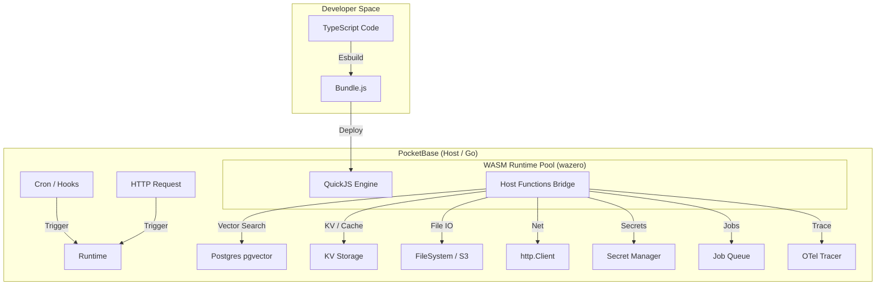
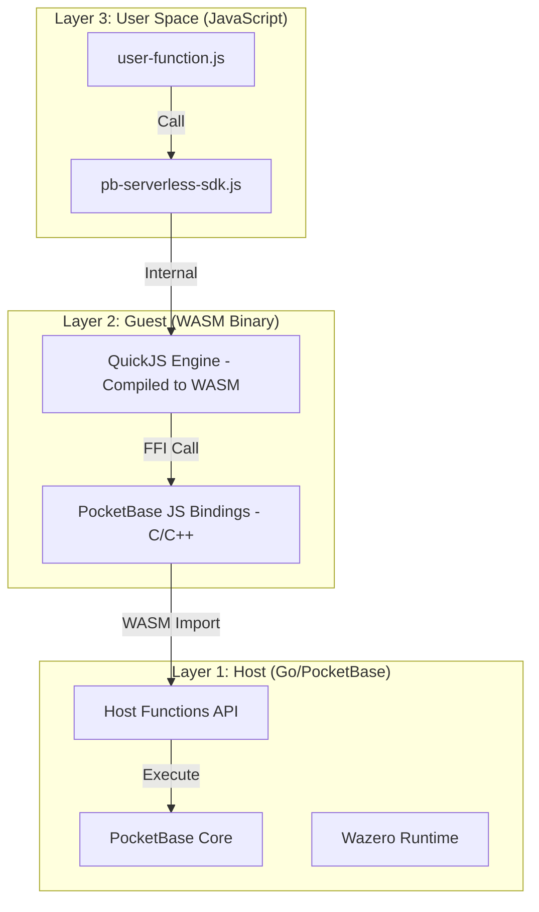

# Feature Specification: PocketBase Serverless Engine (WASM)

**Feature Branch**: `010-serverless-engine`  
**Created**: 2026-01-08  
**Status**: Planning  
**Input**: 
- Research document: `specs/_research/serverless.md`
- QuickJS WASM integration: `specs/_research/quickjs-wasm.md`

## 1. Problem Essence (核心问题)

原有的 Goja 运行时（ES5）无法运行现代 AI 库（Vercel AI SDK, LangChain），缺乏异步 I/O 能力，且无法有效利用 PostgreSQL 的高级特性（如向量检索），限制了 PocketBase 作为 AI Agent 平台的潜力。

**核心矛盾**:
- Serverless: **无状态的计算 (Stateless Compute) vs 有状态的业务 (Stateful Business)**
- AI Agent: **非确定性的输出 (Probabilistic Output) vs 确定性的系统 (Deterministic System)**

**核心理念**: "Single Binary, Full AI Stack."

## 2. Efficiency ROI (效能回报)

| 维度 | 收益 | 量化 |
|------|------|------|
| 开发效率 | 直接复用 NPM 生态（`ai`, `zod`, `tiktoken`），无需用 Go 重写 | 代码量减少 60% |
| 运行性能 | QuickJS (WASM) 相比 Goja 解析速度提升 | 3-5 倍 |
| 部署简便 | 保持"单二进制文件"交付 | 无需 Node.js 容器 |

## 3. Database Compatibility (数据库兼容性)

PocketBase 同时支持 **SQLite** 和 **PostgreSQL**，Serverless Engine 必须在两种数据库上都能正常工作。

### 3.1 特性差异与兼容策略

| 特性 | PostgreSQL | SQLite | 兼容策略 |
|------|------------|--------|----------|
| Vector Search (`pgvector`) | ✅ 原生支持 | ❌ 不支持 | SQLite 使用内存计算 fallback |
| JSONB 索引 | ✅ GIN 索引 | ❌ 不支持 | SQLite 使用 JSON 函数 |
| 并发性能 | 高（行级锁） | 中（写锁串行） | SQLite 适合低并发场景 |

### 3.2 性能预期

| 场景 | PostgreSQL | SQLite |
|------|------------|--------|
| Vector Search (1M docs) | ~50ms | ~500ms (内存计算) |
| 并发 Function 执行 | ~100 并发 | ~10 并发 |
| 推荐使用场景 | 生产环境、AI Agent | 开发环境、简单场景 |

---

## 4. Architecture Overview (架构概览)



### 4.1 Host Functions Matrix (能力矩阵)

| Domain | Capability | Goal | 依赖模块 |
|--------|------------|------|----------|
| **Network** | `fetch`, `ReadableStream`, `TextEncoder` | 100% 兼容 Vercel AI SDK | 内置 |
| **Data** | SQL Query + Vector Search | 简化 RAG 开发 | `pgvector` |
| **State** | Ephemeral KV Store | Agent 短期记忆 | `006-pocketbase-kv` |
| **Storage** | File Reader / Writer | 多模态能力 | 内置 FileSystem |
| **Secrets** | Encrypted KV | API Key 安全存储 | `007-secret-management` |
| **Jobs** | Async Task Queue | 长耗时任务 | `008-job-queue` |
| **Observability** | Structured Logging + Tracing | 全链路观测 | `009-unified-observability` |
| **Utility** | Crypto, UUID, Hash | 避免 JS 侧低效计算 | `plugins/jsvm` 复用 |

---

## 5. QuickJS WASM Runtime (核心运行时)

本节详细描述 QuickJS WASM 运行时的技术实现，这是 Serverless Engine 的核心基础设施。

> **📖 详细技术规格**: 完整的 QuickJS WASM 集成方案请参考 [`specs/_research/quickjs-wasm.md`](../_research/quickjs-wasm.md)，包含：
> - 三层沙箱架构设计（套娃模型）
> - C 代码编译指南（wasi-sdk + QuickJS）
> - Host Function 实现细节
> - 方案对比（QuickJS vs Javy vs Goja）

**核心理念**: "Sandboxed Interpreter" - 在 WASM 容器内运行不可信的 JS 代码，实现近乎原生的启动速度。

### 5.1 The Matryoshka Model (套娃模型)

我们采用三层沙箱架构，实现军事级别的隔离：



**隔离层级**:
- **Layer 1 (Go)**: PocketBase 宿主进程，拥有完整系统权限
- **Layer 2 (WASM)**: QuickJS 引擎运行在 WASM 沙箱中，无法访问宿主文件系统
- **Layer 3 (JS)**: 用户代码运行在 QuickJS 中，只能通过 SDK 调用受限 API

### 5.2 Runtime Binary (`pb_runtime.wasm`)

预编译的通用 WASM 运行时文件，包含：

| 组件 | 描述 | 来源 |
|------|------|------|
| **QuickJS Core** | 2024 版本，开启 `BIGNUM` 支持 | [bellard/quickjs](https://github.com/bellard/quickjs) |
| **Bootloader** | C 代码，读取内存中的 JS 源码并求值 | 自研 |
| **PB Bridge** | C 代码，定义 JS 调用 Go 的标准接口 | 自研 |

**编译工具链**:
```bash
# 使用 wasi-sdk 编译 QuickJS 为 WASM
wasi-sdk/bin/clang \
  -O3 \
  -D_WASI_EMULATED_MMAN \
  -DCONFIG_BIGNUM \
  -o pb_runtime.wasm \
  quickjs.c \
  pb_bridge.c \
  bootloader.c
```

**二进制嵌入**:
```go
//go:embed pb_runtime.wasm
var runtimeWasm []byte
```

### 5.3 Memory Model & Data Exchange (内存模型)

JS 和 Go 之间无法直接共享对象，必须通过 **Shared Linear Memory** 进行交换。

**交互协议 (The ABI)**:

```
┌─────────────────────────────────────────────────────────────┐
│                    WASM Linear Memory                        │
├─────────────────────────────────────────────────────────────┤
│  [0x0000 - 0x1000]  Reserved (Stack Guard)                  │
│  [0x1000 - 0x2000]  Request Buffer (JSON)                   │
│  [0x2000 - 0x3000]  Response Buffer (JSON)                  │
│  [0x3000 - ...]     Heap (QuickJS Managed)                  │
└─────────────────────────────────────────────────────────────┘
```

**JS → Go 调用流程**:
1. JS 调用 `pb_op(op_code, payload_ptr, payload_len)`
2. Payload 是 JSON 序列化后的字节流
3. Go 读取 WASM 内存，解析 JSON，执行逻辑
4. Go 将结果写入 Response Buffer
5. Go 修改 WASM 中的 `ret_ptr` 和 `ret_len`
6. JS 从内存读取结果并 `JSON.parse`

### 5.4 Host Function Definitions (宿主函数)

在 `pb_runtime.wasm` 中导入 (Import) 以下 Go 函数：

| Host Function | Signature (WASM) | Description |
|---------------|------------------|-------------|
| `host_log` | `(ptr, len, level) -> void` | 将 JS 的 console.log 转发给 PocketBase Logger |
| `host_request` | `(op, ptr, len) -> res_ptr` | **万能网关**，所有 DB/Fetch/KV/Queue 操作都走这个入口 |
| `host_error` | `(ptr, len) -> void` | 抛出致命错误，终止实例 |
| `host_alloc` | `(size) -> ptr` | 在 WASM 堆上分配内存 |
| `host_free` | `(ptr) -> void` | 释放 WASM 堆内存 |

**Go 侧实现示例**:
```go
// plugins/serverless/runtime/hostfn/hostfn.go
func (h *HostFunctions) RegisterTo(mod wazero.HostModuleBuilder) {
    mod.NewFunctionBuilder().
        WithFunc(h.hostRequest).
        WithParameterNames("op", "ptr", "len").
        Export("host_request")
    
    mod.NewFunctionBuilder().
        WithFunc(h.hostLog).
        WithParameterNames("ptr", "len", "level").
        Export("host_log")
}

func (h *HostFunctions) hostRequest(ctx context.Context, op uint32, ptr, len uint32) uint32 {
    // 1. 从 WASM 内存读取 JSON
    payload := h.readMemory(ptr, len)
    
    // 2. 根据 op 分发到对应 Handler
    var result []byte
    switch OpCode(op) {
    case OpFetch:
        result = h.handleFetch(ctx, payload)
    case OpDBQuery:
        result = h.handleDBQuery(ctx, payload)
    case OpKVGet:
        result = h.handleKVGet(ctx, payload)
    // ...
    }
    
    // 3. 写入结果到 WASM 内存
    return h.writeMemory(result)
}
```

### 5.5 JavaScript SDK (`pb-serverless-sdk.js`)

在 QuickJS 内部预加载的 JS 垫片，屏蔽底层的内存操作：

```javascript
// 内部桥接层 (预加载到 QuickJS)
const OP_FETCH = 1;
const OP_DB_QUERY = 2;
const OP_KV_GET = 3;
const OP_KV_SET = 4;
const OP_SECRET_GET = 5;
const OP_JOB_ENQUEUE = 6;

function hostCall(op, data) {
    const json = JSON.stringify(data);
    const ptr = __alloc(json.length);
    __writeString(ptr, json);
    
    const resPtr = __host_request(op, ptr, json.length);
    const resJson = __readString(resPtr);
    __free(ptr);
    
    const res = JSON.parse(resJson);
    if (res.error) throw new Error(res.error);
    return res.data;
}

// 公开 SDK API
globalThis.pb = {
    collection: (name) => ({
        getList: (page, perPage, options) => 
            hostCall(OP_DB_QUERY, { op: "list", col: name, page, perPage, ...options }),
        getOne: (id) => 
            hostCall(OP_DB_QUERY, { op: "one", col: name, id }),
        create: (data) => 
            hostCall(OP_DB_QUERY, { op: "create", col: name, data }),
        update: (id, data) => 
            hostCall(OP_DB_QUERY, { op: "update", col: name, id, data }),
        delete: (id) => 
            hostCall(OP_DB_QUERY, { op: "delete", col: name, id }),
        vectorSearch: (options) => 
            hostCall(OP_DB_QUERY, { op: "vector", col: name, ...options }),
    }),
    kv: {
        get: (key) => hostCall(OP_KV_GET, { key }),
        set: (key, value, options) => hostCall(OP_KV_SET, { key, value, ...options }),
    },
    secrets: {
        get: (key) => hostCall(OP_SECRET_GET, { key }),
    },
    jobs: {
        enqueue: (name, payload) => hostCall(OP_JOB_ENQUEUE, { name, payload }),
    },
};

// 实现 Web 标准 fetch
globalThis.fetch = async (url, options = {}) => {
    const result = hostCall(OP_FETCH, { url, ...options });
    return new Response(result.body, {
        status: result.status,
        headers: result.headers,
    });
};
```

### 5.6 Asynchronous & Event Loop (异步处理)

QuickJS 是单线程的，但 PocketBase 业务是异步的（如 Fetch, DB Query）。

**机制选择**: **Host Blocking** 模式

由于 QuickJS 在 WASM 中是同步执行的，当 JS 调用 `await pb.collection().getList()` 时：

1. **JS Side**: 返回一个 Promise
2. **Go Side**: 
   - Go 在独立 Goroutine 中执行阻塞操作（DB Query / HTTP Fetch）
   - 操作完成后，Go 将结果写入 WASM 内存
   - WASM 继续执行，Promise resolve

**为什么不用 Asyncify**:
- Asyncify 会增加 WASM 二进制大小 (~20%)
- 实现复杂度高，调试困难
- Host Blocking 模式足够满足需求（每个 Request 独立 Goroutine）

### 5.7 Execution Lifecycle (执行生命周期)

当 HTTP 请求 `POST /api/pb_serverless/my-func` 到达时：

```
┌──────────────────────────────────────────────────────────────────┐
│ 1. Load         │ 从文件系统读取 JS 源码 (或从缓存)              │
├──────────────────────────────────────────────────────────────────┤
│ 2. Instantiate  │ 从 Wazero Module Cache 取出 runtime.wasm 实例 │
├──────────────────────────────────────────────────────────────────┤
│ 3. Inject       │ 将 Request Body/Headers 写入 WASM 内存        │
├──────────────────────────────────────────────────────────────────┤
│ 4. Eval         │ 调用 WASM 导出函数 run_handler(source_ptr)    │
├──────────────────────────────────────────────────────────────────┤
│ 5. Execute      │ QuickJS 执行 JS，通过 Host Function 交互      │
├──────────────────────────────────────────────────────────────────┤
│ 6. Output       │ 从 WASM 内存读取 Response，返回给客户端       │
├──────────────────────────────────────────────────────────────────┤
│ 7. Cleanup      │ 重置内存归还对象池（或销毁实例）               │
└──────────────────────────────────────────────────────────────────┘
```

### 5.8 Instance Pool (实例池)

为了优化冷启动，使用预热的实例池：

```go
// plugins/serverless/runtime/pool.go
type Pool struct {
    instances chan *Engine
    config    PoolConfig
    module    wazero.CompiledModule
}

type PoolConfig struct {
    Size        int           // 池大小，默认 10
    MaxMemory   uint64        // 单实例最大内存，默认 128MB
    Timeout     time.Duration // 执行超时，默认 30s
}

func (p *Pool) Acquire(ctx context.Context) (*Engine, error) {
    select {
    case engine := <-p.instances:
        return engine, nil
    case <-ctx.Done():
        return nil, ctx.Err()
    }
}

func (p *Pool) Release(engine *Engine) {
    engine.Reset() // 重置内存状态
    p.instances <- engine
}
```

### 5.9 Performance Targets (性能目标)

| 指标 | 目标值 | 测量方法 |
|------|--------|----------|
| 冷启动延迟（无预编译）| < 50ms | Benchmark |
| 冷启动延迟（预编译 Bytecode）| < 5ms | Benchmark |
| 热启动延迟（实例池）| < 2ms | Benchmark |
| 单实例内存占用 | 2-4MB | Runtime Stats |
| 最大并发实例 | 1000+ | 压力测试 |

### 5.10 Security Boundaries (安全边界)

| 约束 | 机制 | 错误处理 |
|------|------|----------|
| **禁止 Node.js 模块** | 仅支持 ESM，预定义白名单 | `Module not found (This is not Node.js)` |
| **执行超时** | Go Context Deadline | 超时后 `Close()` WASM 实例 |
| **内存限制** | Wazero MaxMemory 页数 | 超限后实例被终止 |
| **指令计数** | QuickJS 内置计数器 | 达到上限后抛出异常 |
| **网络白名单** | Host Function 校验 | `ErrHostNotAllowed` |

---

## User Scenarios & Testing *(mandatory)*

### User Story 1 - HTTP Handler (Priority: P1)

作为开发者，我希望能够用 TypeScript 编写 HTTP 处理函数，以便快速构建 AI Agent API。

**Why this priority**: HTTP Handler 是 Serverless 的核心入口，所有其他功能都依赖此能力。

**Independent Test**: 可以通过 curl 调用 `/api/pb_serverless/my-func` 验证函数执行。

**Acceptance Scenarios**:

1. **Given** 函数已部署, **When** `GET /api/pb_serverless/hello`, **Then** 返回 `{"message": "Hello World"}`
2. **Given** 函数已部署, **When** `POST /api/pb_serverless/chat` with body, **Then** 函数接收并处理请求体
3. **Given** 函数返回 Stream, **When** 客户端请求, **Then** 响应以 SSE 流式返回
4. **Given** 函数执行超时（>30s）, **When** 请求, **Then** 返回 `504 Gateway Timeout`
5. **Given** 函数抛出异常, **When** 请求, **Then** 返回 `500 Internal Server Error` 并记录日志

---

### User Story 2 - Fetch API (Priority: P1)

作为开发者，我希望能够在 Serverless 函数中使用标准 `fetch` API，以便调用外部 AI 服务（OpenAI, Anthropic）。

**Why this priority**: Fetch 是 AI SDK 的基础依赖，必须 100% 兼容 Web 标准。

**Independent Test**: 可以通过调用 OpenAI API 验证 fetch 功能。

**Acceptance Scenarios**:

1. **Given** 函数调用 `fetch('https://api.openai.com/...')`, **When** 执行, **Then** 正确发起 HTTP 请求
2. **Given** fetch 返回 JSON, **When** 调用 `response.json()`, **Then** 正确解析响应
3. **Given** fetch 返回 Stream, **When** 调用 `response.body.getReader()`, **Then** 可逐块读取数据
4. **Given** fetch 设置 Headers, **When** 发起请求, **Then** Headers 正确传递
5. **Given** fetch 目标不在白名单, **When** 发起请求, **Then** 返回 `ErrHostNotAllowed`

---

### User Story 3 - Vector Search (Priority: P1)

作为开发者，我希望能够使用简洁的 API 进行向量搜索，以便快速实现 RAG 功能。

**Why this priority**: Vector Search 是 AI Agent 的核心能力，避免手写复杂 SQL。

**Independent Test**: 可以通过 `pb.collection().vectorSearch()` 验证向量检索。

**Acceptance Scenarios**:

1. **Given** Collection 有 embedding 字段, **When** 调用 `vectorSearch({vector: [...], top: 5})`, **Then** 返回最相似的 5 条记录
2. **Given** 向量维度不匹配, **When** 调用 vectorSearch, **Then** 返回 `ErrDimensionMismatch`
3. **Given** 指定 filter 条件, **When** 调用 vectorSearch, **Then** 先过滤再排序
4. **Given** SQLite 环境, **When** 调用 vectorSearch, **Then** 使用内存余弦相似度计算（fallback）
5. **Given** PostgreSQL 环境, **When** 调用 vectorSearch, **Then** 使用 `<=>` 操作符（pgvector）

---

### User Story 4 - KV Storage (Priority: P1)

作为开发者，我希望能够使用轻量级 KV 存储，以便实现 Agent 对话的短期记忆。

**Why this priority**: Agent 需要在多轮对话中保持状态，直接操作数据库表太重。

**Independent Test**: 可以通过 `pb.kv.set()` 和 `pb.kv.get()` 验证状态存储。

**Acceptance Scenarios**:

1. **Given** 函数执行中, **When** 调用 `pb.kv.set('session:123', {...}, {ttl: 600})`, **Then** 数据存储成功
2. **Given** 数据已存储, **When** 调用 `pb.kv.get('session:123')`, **Then** 返回存储的对象
3. **Given** TTL 已过期, **When** 调用 `pb.kv.get('session:123')`, **Then** 返回 `null`
4. **Given** 并发写入, **When** 多个请求同时写入相同 Key, **Then** 最后写入者胜出

**依赖**: 复用 `006-pocketbase-kv` 模块

---

### User Story 5 - File API (Priority: P1)

作为开发者，我希望能够读写文件，以便处理 AI 生成的图片、PDF 等多模态内容。

**Why this priority**: 多模态 AI 需要处理图片、文档等文件。

**Independent Test**: 可以通过 `pb.files.read()` 和 `pb.files.save()` 验证文件操作。

**Acceptance Scenarios**:

1. **Given** Record 有文件字段, **When** 调用 `pb.files.read(collId, recordId, 'avatar.jpg')`, **Then** 返回 ArrayBuffer
2. **Given** AI 生成图片, **When** 调用 `pb.files.save(collId, recordId, {filename, data})`, **Then** 文件保存成功
3. **Given** 文件不存在, **When** 调用 `pb.files.read()`, **Then** 返回 `ErrFileNotFound`
4. **Given** 文件超过大小限制, **When** 调用 `pb.files.save()`, **Then** 返回 `ErrFileTooLarge`

---

### User Story 6 - Secrets Access (Priority: P1)

作为开发者，我希望能够安全地访问 API Key 等敏感配置，以便调用第三方 AI 服务。

**Why this priority**: AI 服务强依赖 API Key，硬编码极不安全。

**Independent Test**: 可以通过 `pb.secrets.get('OPENAI_API_KEY')` 验证密钥读取。

**Acceptance Scenarios**:

1. **Given** Secret 已配置, **When** 调用 `pb.secrets.get('OPENAI_API_KEY')`, **Then** 返回解密后的值
2. **Given** Secret 不存在, **When** 调用 `pb.secrets.get('NONEXISTENT')`, **Then** 返回 `null`
3. **Given** 函数执行, **When** Secret 值被读取, **Then** 值不会出现在日志中

**依赖**: 复用 `007-secret-management` 模块

---

### User Story 7 - Job Queue Integration (Priority: P1)

作为开发者，我希望能够将耗时任务入队异步执行，以便避免 HTTP 超时。

**Why this priority**: RAG 索引构建等任务可能耗时数分钟，必须异步处理。

**Independent Test**: 可以通过 `pb.jobs.enqueue()` 验证任务入队。

**Acceptance Scenarios**:

1. **Given** HTTP Handler 接收请求, **When** 调用 `pb.jobs.enqueue('process_pdf', {fileId})`, **Then** 返回 jobId，请求立即响应
2. **Given** Worker 函数已注册, **When** 任务入队, **Then** Worker 自动执行任务
3. **Given** 任务执行失败, **When** 重试次数未达上限, **Then** 任务按指数退避重试

**依赖**: 复用 `008-job-queue` 模块

---

### User Story 8 - DB Hooks (Priority: P1)

作为开发者，我希望能够用 TypeScript 编写数据库钩子，以便替代原有的 Goja Hook。

**Why this priority**: Hook 是 PocketBase 的核心扩展机制，必须支持。

**Independent Test**: 可以通过创建 Record 触发 `onRecordBeforeCreate` 钩子验证。

**Acceptance Scenarios**:

1. **Given** Hook 已注册, **When** 创建 Record, **Then** `onRecordBeforeCreate` 被调用
2. **Given** Hook 修改数据, **When** 创建 Record, **Then** 修改后的数据被保存
3. **Given** Hook 抛出异常, **When** 创建 Record, **Then** 操作被中止，返回错误
4. **Given** Hook 返回 false, **When** 创建 Record, **Then** 操作被取消

---

### User Story 9 - Cron Trigger (Priority: P2)

作为开发者，我希望能够定时触发 Serverless 函数，以便实现"每天早上总结新闻"等场景。

**Why this priority**: 定时任务是 Agent 自主性的关键能力。

**Independent Test**: 可以通过配置 Cron 表达式验证定时触发。

**Acceptance Scenarios**:

1. **Given** 函数配置了 Cron `0 8 * * *`, **When** 到达 08:00, **Then** 函数被自动触发
2. **Given** Cron 函数执行中, **When** 到达下一个触发时间, **Then** 跳过本次触发（防止重叠）
3. **Given** Cron 函数执行失败, **When** 记录日志, **Then** 错误信息可在 Admin UI 查看

**实现**: 复用 PocketBase 现有的 Cron 能力，无需新增配置

---

### User Story 10 - Transaction Support (Priority: P1)

作为开发者，我希望能够在函数中使用事务，以便保证"扣余额 -> 调用 AI -> 保存记录"的原子性。

**Why this priority**: 数据一致性是生产环境的核心需求。

**Independent Test**: 可以通过 `pb.tx()` 验证事务回滚。

**Acceptance Scenarios**:

1. **Given** 事务中执行多个操作, **When** 全部成功, **Then** 统一提交
2. **Given** 事务中某操作失败, **When** 抛出异常, **Then** 全部回滚
3. **Given** 事务中调用 fetch, **When** fetch 失败, **Then** 之前的数据库操作回滚
4. **Given** 事务嵌套, **When** 内层事务失败, **Then** 外层事务也回滚

---

### User Story 11 - Structured Logging (Priority: P1)

作为开发者，我希望 `console.log` 输出结构化日志，以便在生产环境排查问题。

**Why this priority**: 日志是运维的核心能力，单纯的 console.log 在生产环境是灾难。

**Independent Test**: 可以通过 `console.log()` 验证日志格式。

**Acceptance Scenarios**:

1. **Given** 函数调用 `console.log("Processing", {userId: 1})`, **When** 输出日志, **Then** 格式为 `{"level":"info", "msg":"Processing", "userId":1, "trace_id":"..."}`
2. **Given** 函数调用 `console.error(err)`, **When** 输出日志, **Then** 包含错误堆栈
3. **Given** 请求有 TraceID, **When** 输出日志, **Then** 日志包含 `trace_id` 字段

**依赖**: 复用 `009-unified-observability` 模块

---

### User Story 12 - Utility Functions (Priority: P2)

作为开发者，我希望能够使用高性能的工具函数（UUID、Hash），以便避免在 JS 侧进行低效计算。

**Why this priority**: CPU 密集型操作在 WASM 中效率低，应调用 Go 实现。

**Independent Test**: 可以通过 `pb.utils.uuid()` 验证工具函数。

**Acceptance Scenarios**:

1. **Given** 调用 `pb.utils.uuid()`, **When** 执行, **Then** 返回 UUID v7（时间有序）
2. **Given** 调用 `pb.utils.hash('password')`, **When** 执行, **Then** 返回哈希值
3. **Given** 调用 `pb.utils.randomString(16)`, **When** 执行, **Then** 返回 16 位随机字符串

**实现**: 复用 `plugins/jsvm` 已有的 Go bindings

---

### Edge Cases

- 函数执行超过 30 秒如何处理？强制终止，返回 504
- 函数内存超过 128MB 如何处理？强制终止，返回 503
- 函数死循环如何处理？指令计数器达到上限后终止
- fetch 目标是内网 IP 如何处理？白名单机制，默认禁止
- 并发请求过多如何处理？WASM 实例池限制并发数
- 部署新版时旧版正在执行如何处理？Graceful Shutdown，等待旧版完成

---

### Assumptions

1. 使用 QuickJS 作为 JS 引擎（通过 wazero 运行 WASM）
2. 函数代码通过 esbuild 打包为单一 bundle.js
3. 支持 ES2022+ 语法（async/await, optional chaining 等）
4. 不支持 Node.js 内置模块（fs, child_process 等）
5. 这是 Edge Runtime 环境，非 Node.js 环境
6. 同时支持 SQLite 和 PostgreSQL 数据库
7. WASM 实例池大小默认 10，可配置
8. 默认 HTTP 超时 30 秒，Cron 超时 15 分钟
9. 流式响应不受超时限制（只要连接保持活跃）

---

## Functional Requirements

### Runtime Core (QuickJS WASM)

| ID | Requirement | Priority | Description |
|----|-------------|----------|-------------|
| FR-R01 | QuickJS WASM 编译 | P0 | 使用 wasi-sdk 将 QuickJS 编译为 WASM，嵌入 PocketBase 二进制 |
| FR-R02 | Wazero 集成 | P0 | 使用 wazero 作为 WASM 运行时，零 CGO 依赖 |
| FR-R03 | Host Functions 桥接 | P0 | 实现 host_request/host_log/host_error 等宿主函数 |
| FR-R04 | 内存交换协议 | P0 | 实现 JSON-based ABI 用于 JS/Go 数据交换 |
| FR-R05 | JS SDK 预加载 | P0 | 在 QuickJS 启动时预加载 pb-serverless-sdk.js |
| FR-R06 | 实例池管理 | P1 | 预热 WASM 实例池，支持并发复用 |
| FR-R07 | 实例重置机制 | P1 | 请求完成后重置内存状态，归还实例池 |
| FR-R08 | Bytecode 预编译 | P2 | 支持 QuickJS bytecode 缓存，加速冷启动 |

### API Capabilities

| ID | Requirement | Priority | User Story |
|----|-------------|----------|------------|
| FR-001 | 支持 HTTP Handler（GET/POST/STREAM）| P1 | US1 |
| FR-002 | 支持 Web 标准 Fetch API | P1 | US2 |
| FR-003 | 支持 ReadableStream 流式响应 | P1 | US2 |
| FR-004 | 支持 Vector Search API | P1 | US3 |
| FR-005 | 支持 KV Storage API | P1 | US4 |
| FR-006 | 支持 File Read/Write API | P1 | US5 |
| FR-007 | 支持 Secrets API | P1 | US6 |
| FR-008 | 支持 Job Queue API | P1 | US7 |
| FR-009 | 支持 DB Hooks（Before/After Create/Update/Delete）| P1 | US8 |
| FR-010 | 支持 Cron 触发 | P2 | US9 |
| FR-011 | 支持 Scope-based Transaction | P1 | US10 |
| FR-012 | 支持 Structured Logging | P1 | US11 |
| FR-013 | 支持 Utility Functions（UUID, Hash）| P2 | US12 |

### Security & Resource Control

| ID | Requirement | Priority | Description |
|----|-------------|----------|-------------|
| FR-014 | 支持 WASM 实例池（并发控制）| P1 | 限制最大并发实例数 |
| FR-015 | 支持执行超时限制（30s HTTP / 15min Cron）| P1 | Context Deadline 强制终止 |
| FR-016 | 支持内存限制（128MB）| P1 | Wazero MaxMemory 页数限制 |
| FR-017 | 支持指令计数器（防死循环）| P2 | QuickJS 内置计数器 |
| FR-018 | 支持网络白名单 | P2 | Host Function 校验目标域名 |
| FR-019 | 支持 TypeScript 开发（esbuild 打包）| P1 | 开发时编译，运行时执行 JS |
| FR-020 | 支持 Bytecode 预编译（冷启动优化）| P3 | QuickJS 字节码缓存 |

---

## Non-Functional Requirements (Boundaries)

| ID | Constraint | Limit |
|----|------------|-------|
| NFR-001 | 单实例内存上限 | 128MB |
| NFR-002 | HTTP 执行超时 | 30 秒 |
| NFR-003 | Cron 执行超时 | 15 分钟 |
| NFR-004 | 最大指令数（防死循环）| 10 亿条 |
| NFR-005 | 禁止访问宿主机文件系统 | 仅通过 pb.files API |
| NFR-006 | 禁止 Node.js 内置模块 | fs, child_process, cluster 等 |
| NFR-007 | 网络访问白名单 | 可配置 allowed_hosts |

---

## Success Criteria

### Runtime Performance

| ID | Metric | Target | Measurement |
|----|--------|--------|-------------|
| SC-R01 | WASM 模块编译时间 | < 100ms | 首次加载 |
| SC-R02 | 热启动延迟（实例池）| < 2ms | Benchmark 测试 |
| SC-R03 | 冷启动延迟（无预编译）| < 50ms | Benchmark 测试 |
| SC-R04 | 冷启动延迟（预编译 Bytecode）| < 5ms | Benchmark 测试 |
| SC-R05 | 单实例内存占用 | 2-4MB | Runtime Stats |
| SC-R06 | Host Function 调用开销 | < 0.1ms | Benchmark 测试 |

### API Performance

| ID | Metric | Target | Measurement |
|----|--------|--------|-------------|
| SC-001 | Fetch 请求延迟开销 | < 5ms | 对比直接 Go HTTP |
| SC-002 | Vector Search 延迟（PostgreSQL）| < 100ms (1M docs) | Benchmark 测试 |
| SC-003 | 并发 Function 执行 | > 50 并发 | 压力测试 |
| SC-004 | Vercel AI SDK 兼容性 | 100% | 集成测试 |
| SC-005 | OpenAI SDK 兼容性 | 100% | 集成测试 |
| SC-006 | 测试覆盖率 | > 80% | go test -cover |

---

## Project Structure

```text
my-pocketbase-project/
├── pb_data/
├── pb_serverless/          <-- Serverless 根目录
│   ├── package.json        <-- 定义依赖 (zod, ai, langchain)
│   ├── tsconfig.json
│   ├── src/
│   │   ├── routes/
│   │   │   ├── chat.ts     <-- HTTP Handler: POST /api/pb_serverless/chat
│   │   │   └── hello.ts    <-- HTTP Handler: GET /api/pb_serverless/hello
│   │   ├── hooks/
│   │   │   └── users.ts    <-- DB Hooks: onRecordBeforeCreate('users')
│   │   └── workers/
│   │       └── pdf.ts      <-- Job Worker: process_pdf
│   └── dist/
│       └── bundle.js       <-- esbuild 打包输出
└── pocketbase              <-- Binary
```

---

## JS SDK API 设计预览

```typescript
// HTTP Handler
export async function POST(req: Request): Promise<Response> {
  const { message } = await req.json();
  
  // 读取 Secret
  const apiKey = pb.secrets.get('OPENAI_API_KEY');
  
  // 调用 AI
  const response = await fetch('https://api.openai.com/v1/chat/completions', {
    method: 'POST',
    headers: { 'Authorization': `Bearer ${apiKey}` },
    body: JSON.stringify({ model: 'gpt-4', messages: [{ role: 'user', content: message }] })
  });
  
  // 流式返回
  return new Response(response.body, {
    headers: { 'Content-Type': 'text/event-stream' }
  });
}

// Vector Search
const similar = await pb.collection('docs').vectorSearch({
  vector: [0.1, 0.2, ...],
  field: 'embedding',
  filter: 'status = "public"',
  top: 5
});

// KV Storage
await pb.kv.set('chat_session:123', { stage: 'step_2' }, { ttl: 600 });
const state = await pb.kv.get('chat_session:123');

// File API
const imageBuffer = await pb.files.read('coll_id', 'record_id', 'avatar.jpg');
await pb.files.save('coll_id', 'record_id', { filename: 'generated.png', data: buffer });

// Job Queue
const jobId = await pb.jobs.enqueue('process_pdf', { fileId: '123' });

// Transaction
await pb.tx(async (tx) => {
  await tx.collection('wallets').update(uid, { balance: -10 });
  await fetch('https://api.openai.com...');
  await tx.collection('chats').create({...});
});

// Utility
const id = pb.utils.uuid();
const hash = pb.utils.hash('password');
```

---

## DB Hook API 设计预览

```typescript
// hooks/users.ts
import { pb } from 'pocketbase-serverless';

pb.onRecordBeforeCreate('users', async (e) => {
  // 验证邮箱域名
  if (!e.record.email.endsWith('@company.com')) {
    throw new Error('Only company emails allowed');
  }
  
  // 自动填充字段
  e.record.set('created_by', e.auth?.id);
});

pb.onRecordAfterCreate('users', async (e) => {
  // 发送欢迎邮件
  await pb.jobs.enqueue('send_welcome_email', { userId: e.record.id });
});
```

---

## Cron Job 配置预览

```typescript
// workers/daily-report.ts
import { pb } from 'pocketbase-serverless';

// 使用 PocketBase 现有的 Cron 能力
pb.cron('daily_report', '0 8 * * *', async () => {
  const news = await fetchLatestNews();
  const summary = await generateSummary(news);
  await pb.collection('reports').create({ date: new Date(), content: summary });
});
```

---

## Dependencies (依赖模块)

### External Dependencies (外部依赖)

| 依赖 | 版本 | 用途 | License |
|------|------|------|---------|
| [QuickJS](https://bellard.org/quickjs/) | 2024-01 | JavaScript 引擎核心 | MIT |
| [wazero](https://github.com/tetratelabs/wazero) | v1.8+ | 纯 Go WASM 运行时 | Apache-2.0 |
| [wasi-sdk](https://github.com/WebAssembly/wasi-sdk) | v22+ | QuickJS 编译工具链 | Apache-2.0 |
| [esbuild](https://esbuild.github.io/) | v0.20+ | TypeScript 打包 | MIT |

### Internal Dependencies (内部模块)

| 模块 | 状态 | 用途 |
|------|------|------|
| `006-pocketbase-kv` | Ready for Dev | KV Storage API |
| `007-secret-management` | Ready for Dev | Secrets API |
| `008-job-queue` | Ready for Dev | Job Queue API |
| `009-unified-observability` | Ready for Dev | Structured Logging |
| `plugins/jsvm` | Existing | Utility Functions 复用 |
