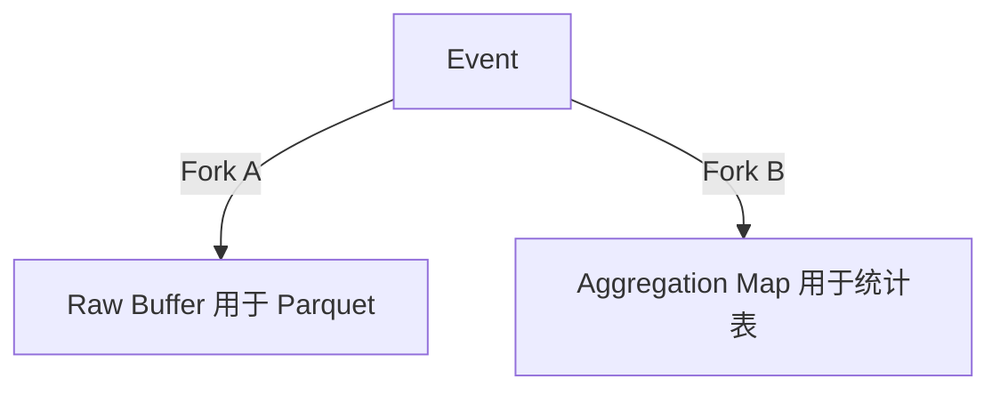

# Analytics 插件代码审查报告

> **审查时间**: 2026-02-05
> **更新时间**: 2026-02-05 (P1 问题已修复)
> **审查范围**: `plugins/analytics/` 目录
> **对照文档**: 
> - `/specs/_research/native-analytics.md` (原始需求)
> - `/specs/007-native-analytics/spec.md` (规格说明书)

---

## 🎯 修复进度

| 优先级 | 问题 | 状态 | 备注 |
|--------|------|------|------|
| **P1** | Buffer 中 HLL 未更新 | ✅ 已修复 | `buffer.go` 现已正确更新 HLL |
| **P1** | Cron 清理任务未注册 | ✅ 已修复 | `register.go` 已注册 `__pbAnalyticsPrune__` 任务 |
| **P2** | Parquet 写入未实现 | ⏳ 待定 | 需引入新依赖，暂跳过 |
| **P2** | 原始日志下载 API | ⏳ 待定 | 依赖 Parquet 功能，暂跳过 |
| **P3** | UNLOGGED 表（PG） | ⏳ 待定 | 性能优化 |
| **P3** | avg_dur / Bounce Rate | ⏳ 待定 | Dashboard 指标不完整 |

---

## 📊 总体评估

| 维度 | 评分 | 说明 |
|------|------|------|
| **架构设计** | ⭐⭐⭐⭐⭐ | Fork & Flush 架构完整实现 |
| **代码质量** | ⭐⭐⭐⭐ | 结构清晰，但有改进空间 |
| **需求覆盖** | ⭐⭐⭐⭐ | 核心功能完成，部分高级功能待实现 |
| **测试覆盖** | ⭐⭐⭐⭐ | 74.8% 覆盖率，核心路径覆盖良好 |
| **文档完整** | ⭐⭐⭐⭐⭐ | README 和代码注释完善 |

---

## ✅ 亮点（符合需求规格的部分）

### 1. Fork & Flush 架构 ✅

完全符合 spec 中的设计：



**实现位置**: `plugins/analytics/buffer.go`

```go
// Buffer 是分析事件的内存缓冲区。
// 它实现了 Fork & Flush 架构中的 Fork 部分：
// - Raw Buffer: 存储原始事件，用于写入 Parquet
// - Aggregation Map: 存储聚合数据，用于写入统计表
type Buffer struct {
    // ...
}

// Push 将事件推入缓冲区。
// 事件会同时进入 Raw Buffer 和 Aggregation Map（Fork）。
func (b *Buffer) Push(event *Event) error {
    // Fork A: 写入 Raw Buffer
    b.rawBuffer = append(b.rawBuffer, event)
    
    // Fork B: 更新 Aggregation Map
    b.updateAggregation(event)
    b.updateSourceAggregation(event)
    b.updateDeviceAggregation(event)
}
```

### 2. HyperLogLog UV 去重 ✅

使用 `axiomhq/hyperloglog` 库实现，支持跨天合并：

**实现位置**: `plugins/analytics/hll.go`

```go
// Add 添加一个元素到 HLL。
// 通常使用 SessionID 或 UserID 作为元素。
func (h *HLL) Add(element string) {
    h.sketch.Insert([]byte(element))
}

// MergeHLLBytes 合并多个 HLL 字节数组
// 这是一个便捷函数，用于跨天 UV 合并
func MergeHLLBytes(sketches ...[]byte) ([]byte, uint64, error)
```

### 3. 双模存储适配 ✅

SQLite 和 PostgreSQL 实现了相同的 Repository 接口：

**实现位置**: `plugins/analytics/repository.go`

```go
// repository.go - 统一接口
type Repository interface {
    UpsertDaily(ctx context.Context, stat *DailyStat) error
    UpsertSource(ctx context.Context, stat *SourceStat) error
    UpsertDevice(ctx context.Context, stat *DeviceStat) error
    GetDailyStats(...) ([]*DailyStat, error)
    // ...
}

// repository_sqlite.go - SQLite 实现
type RepositorySQLite struct { db dbx.Builder }

// repository_postgres.go - PostgreSQL 实现
type RepositoryPostgres struct { db dbx.Builder }
```

### 4. Read-Merge-Write HLL 合并 ✅

符合 spec 中的 UV 合并逻辑：

**实现位置**: `plugins/analytics/repository_sqlite.go`

```go
// UpsertDaily 更新或插入每日统计数据。
// 如果记录已存在，则累加 PV 并合并 HLL Sketch。
func (r *RepositorySQLite) UpsertDaily(ctx context.Context, stat *DailyStat) error {
    // 1. Read: 查询现有记录
    err := r.db.Select("total_pv", "total_uv", "visitors")...
    
    if err == nil {
        // 2. Merge: 合并 HLL
        mergedHLL := NewHLL()
        mergedHLL.MergeBytes(existing.TotalUV)
        mergedHLL.MergeBytes(stat.TotalUV)
        
        // 3. Write: 写回数据库
        r.db.Update("_analytics_daily", ...)
    }
}
```

### 5. URL 规范化 ✅

去参、去 Hash 实现完整：

**实现位置**: `plugins/analytics/url.go`

```go
func NormalizeURL(rawURL string) string
// "/home?ref=twitter"  → "/home"
// "/pricing#features"  → "/pricing"
```

### 6. 爬虫过滤 ✅

支持 30+ 常见爬虫检测：

**实现位置**: `plugins/analytics/ua.go`

```go
func IsBotUserAgent(ua string) bool
// 检测: googlebot, bingbot, gptbot, claudebot, semrush, ahrefs...
```

### 7. 失败重试与数据恢复 ✅

实现了指数退避重试和数据恢复：

**实现位置**: `plugins/analytics/flusher.go`

```go
// FlushWithRetry 执行刷新操作，失败时进行重试
func (f *Flusher) FlushWithRetry(...) error {
    // 1. 原子获取数据（清空 buffer）
    dailyAggs := f.buffer.DrainAggregations()
    
    for attempt := 0; attempt <= maxRetries; attempt++ {
        err := f.writeAggregationsFromMaps(...)
        if err == nil { return nil }
        
        // 指数退避: delay * 2^attempt
        delay := retryDelay * time.Duration(1<<uint(attempt))
        time.Sleep(delay)
    }
    
    // 3. 全部失败，恢复数据到 buffer
    f.restoreAggregations(dailyAggs, ...)
}
```

### 8. NoOp 模式 ✅

禁用时零开销：

**实现位置**: `plugins/analytics/noop.go`

```go
type NoopAnalytics struct{}

func (n *NoopAnalytics) Track(*Event) error { return nil }
func (n *NoopAnalytics) IsEnabled() bool    { return false }
// 所有方法都是空实现
```

---

## ⚠️ 待改进项（与 spec 存在差距）

### 1. 🔴 Parquet 写入未实现

**状态**: ⏳ 待定（需引入新依赖 `parquet-go`）

**Spec 要求** (FR-012, FR-013, FR-014):
> - SQLite 模式 MUST 将原始日志存入 `pb_data/analytics/YYYY-MM-DD.parquet`
> - PostgreSQL 模式 MUST 将原始日志存入配置的 S3 Bucket

**当前实现** (`plugins/analytics/flusher.go`):

```go
// flushRawToParquet 将原始事件刷新到 Parquet 文件。
func (f *Flusher) flushRawToParquet(ctx context.Context) error {
    events := f.buffer.DrainRaw()
    if len(events) == 0 {
        return nil
    }

    // TODO: 实现 Parquet 写入
    // - SQLite 模式：写入本地文件
    // - PostgreSQL 模式：写入 S3

    return nil
}
```

**影响**: 无法保存原始日志用于深度分析（DuckDB/Python 离线分析）

**建议优先级**: P2（核心 Dashboard 已可用，Parquet 是高级功能）

---

### 2. ✅ Buffer 中的 HLL 已正确使用（已修复）

**状态**: ✅ 已于 2026-02-05 修复

**修复内容**:
- `buffer.go` 中 `updateAggregation()` 现在正确更新 HLL
- `updateSourceAggregation()` 现在正确更新 HLL  
- `updateDeviceAggregation()` 现在正确更新 HLL
- `DrainAggregations()` 在返回前序列化 HLL 到字节数组
- `RestoreAggregations()` 正确合并 HLL

**测试覆盖**: 新增 6 个测试用例验证 HLL 去重功能

```go
// 新增测试用例
- TestBufferAggregation_HLLDedup
- TestBufferAggregation_HLLMultipleSessions
- TestBufferSourceAggregation_HLLDedup
- TestBufferDeviceAggregation_HLLDedup
- TestBufferAggregation_EmptySessionID
- TestBufferRestoreAggregations_MergeHLL_Proper
```

---

### 3. ✅ 来源统计已使用 HLL（已修复）

**状态**: ✅ 已于 2026-02-05 修复（作为 P1 修复的一部分）

---

### 4. 🟡 原始日志下载接口未实现

**状态**: ⏳ 待定（依赖 Parquet 功能）

**Spec 要求** (FR-022):
> 系统 MUST 提供 `GET /api/analytics/raw-logs` 下载原始日志

**当前实现** (`plugins/analytics/handlers_stats.go`):

```go
// rawLogsHandler 处理原始日志下载请求
func rawLogsHandler(app core.App) func(*core.RequestEvent) error {
    return func(e *core.RequestEvent) error {
        // TODO: 实现下载逻辑
        // - SQLite 模式：返回本地 Parquet 文件
        // - PostgreSQL 模式：生成 S3 Presigned URL 并重定向

        return e.NotFoundError("Raw logs download not implemented yet", nil)
    }
}
```

---

### 5. ✅ 数据清理 Cron 任务已注册（已修复）

**状态**: ✅ 已于 2026-02-05 修复

**修复内容**:
- 在 `register.go` 中添加 `registerPruneCronJob()` 函数
- Cron 任务 ID: `__pbAnalyticsPrune__`
- 执行时间: 每天凌晨 3 点 (`0 3 * * *`)
- 根据 `config.Retention` 配置的天数清理过期数据

**测试覆盖**: 新增 2 个测试用例

```go
// 新增测试用例
- TestRegister_CronJob           // 验证 Cron 任务注册
- TestRegister_CronJob_Disabled  // 验证禁用模式下不注册
```

---

### 6. 🟢 平均停留时长 (avg_dur) 未计算

**Spec Schema**:
> `avg_dur` | number | 平均停留时长 (ms)

**当前实现**: 字段存在但始终为 0：

```go
stat := &DailyStat{
    // ...
    AvgDur: 0,  // 永远是 0
}
```

**原因**: 需要前端 SDK 提供 `duration` 数据（页面停留时间）

---

### 7. 🟢 Bounce Rate 未实现

**Spec 要求** (Acceptance Scenario):
> 显示 PV、UV、Bounce Rate 等核心指标卡片

**当前实现**: 没有跳出率计算逻辑

---

## 📋 需求对照检查表

### 数据采集层

| 需求 | 状态 | 说明 |
|------|------|------|
| FR-001: JS SDK 自动采集 page_view | ⏳ | 后端 API 已就绪，需 JS SDK 实现 |
| FR-002: pb.analytics.track() | ⏳ | 后端 API 已就绪，需 JS SDK 实现 |
| FR-003: 批量缓存 + Beacon API | ⏳ | 后端支持批量，需 JS SDK 实现 |
| FR-004: optOut() GDPR 支持 | ⏳ | 需 JS SDK 实现 |
| FR-005: identify() 用户关联 | ⏳ | 后端支持 UserID，需 JS SDK 实现 |

### 数据处理层

| 需求 | 状态 | 说明 |
|------|------|------|
| FR-006: Fork & Flush 架构 | ✅ | 完整实现 |
| FR-007: 10 秒 Flush 到数据库 | ✅ | 完整实现 |
| FR-008: 16MB Raw Buffer 阈值 | ✅ | 实现但 Parquet 写入是 TODO |
| FR-009: URL Normalization | ✅ | 完整实现 |
| FR-010: HyperLogLog UV 去重 | ✅ | 已修复：Buffer 中正确更新 HLL |
| FR-011: Read-Merge-Write HLL | ✅ | Repository 中正确实现 |

### 存储层

| 需求 | 状态 | 说明 |
|------|------|------|
| FR-012: SQLite Parquet 存储 | ❌ | TODO |
| FR-013: SQLite 独立统计 DB | ⚠️ | 使用 auxiliary.db 而非独立 analytics.db |
| FR-014: PostgreSQL S3 存储 | ❌ | TODO |
| FR-015: PostgreSQL UNLOGGED 表 | ❌ | 当前使用普通表 |
| FR-016: 无 S3 时降级 | ✅ | 逻辑正确（仅丢弃 raw log） |

### API 层

| 需求 | 状态 | 说明 |
|------|------|------|
| FR-017: POST /api/analytics/events | ✅ | 完整实现 |
| FR-018: GET /api/analytics/stats | ✅ | 完整实现 |
| FR-019: GET /api/analytics/top-pages | ✅ | 完整实现 |
| FR-020: GET /api/analytics/top-sources | ✅ | 完整实现 |
| FR-021: GET /api/analytics/devices | ✅ | 完整实现 |
| FR-022: GET /api/analytics/raw-logs | ❌ | TODO |
| FR-023: 管理员认证 | ✅ | 使用 RequireSuperuserAuth |

### 配置与清理

| 需求 | 状态 | 说明 |
|------|------|------|
| FR-031: analyticsEnabled 开关 | ✅ | 完整实现 |
| FR-032: analyticsS3Bucket 配置 | ✅ | 配置存在但未使用 |
| FR-033: analyticsRetention 配置 | ✅ | 配置存在但 Cron 未注册 |
| FR-034: Cron 自动清理 | ✅ | 已修复：`__pbAnalyticsPrune__` 任务已注册 |

---

## 🔧 建议修复优先级

| 优先级 | 问题 | 状态 |
|--------|------|------|
| **P1** | Buffer 中 HLL 未更新 | ✅ 已修复 |
| **P1** | Cron 清理任务未注册 | ✅ 已修复 |
| **P2** | Parquet 写入未实现 | ⏳ 待定（需新依赖） |
| **P2** | 原始日志下载 API | ⏳ 待定（依赖 Parquet） |
| **P3** | UNLOGGED 表（PG） | ⏳ 待定 |
| **P3** | avg_dur / Bounce Rate | ⏳ 待定 |

---

## 📊 代码质量建议

### 1. 代码重复

`flushAggregations()` 和 `writeAggregationsFromMaps()` 逻辑重复：

```go
// 建议：删除 flushAggregations()，统一使用 writeAggregationsFromMaps
func (f *Flusher) Flush(ctx context.Context) error {
    dailyAggs := f.buffer.DrainAggregations()
    // ...
    return f.writeAggregationsFromMaps(ctx, dailyAggs, sourceAggs, deviceAggs)
}
```

### 2. 单元测试改进

建议添加真实数据库的集成测试（当前 mock 可能遗漏边界情况）：

```go
func TestRepositorySQLite_Integration(t *testing.T) {
    dsn := skipIfNoTestDB(t)
    // 使用真实 SQLite 数据库测试
}
```

---

## 📝 总结

Analytics 插件的**核心架构设计符合 spec 要求**，Fork & Flush 模型、HyperLogLog UV 去重、双模存储适配等关键设计都已正确实现。

### ✅ 已修复问题 (2026-02-05)

1. **Buffer 中 HLL 更新逻辑** - UV 统计现在正确去重
2. **数据清理 Cron 任务** - 已注册 `__pbAnalyticsPrune__`，每天凌晨 3 点执行

### ⏳ 待处理问题

1. **Parquet 写入功能** - 需要引入新的依赖库
2. **原始日志下载 API** - 依赖 Parquet 功能
3. **PostgreSQL UNLOGGED 表** - 性能优化（P3）
4. **avg_dur / Bounce Rate** - Dashboard 指标（P3）

---

## 下一步行动

1. ~~**立即修复**: Buffer 中 HLL 更新逻辑~~ ✅ 已完成
2. ~~**立即修复**: 注册数据清理 Cron 任务~~ ✅ 已完成
3. **计划实现**: Parquet 写入功能（需评估依赖引入）
4. **计划实现**: 原始日志下载 API
5. **优化改进**: PostgreSQL UNLOGGED 表
