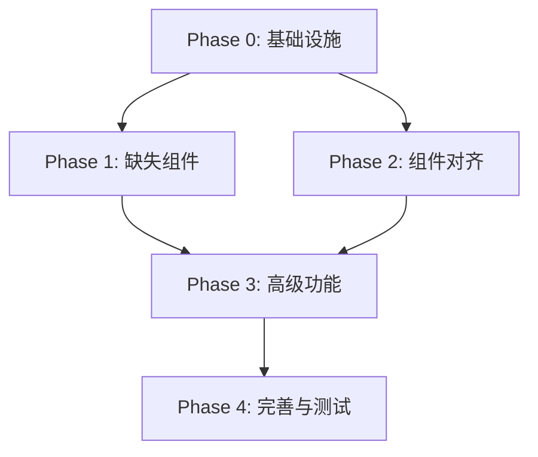

# Implementation Plan: WebUI New Record 功能 1:1 对齐

**Feature Branch**: `032-webui-new-record-alignment`  
**Created**: 2026-02-09  
**Status**: Planning  
**Spec**: [spec.md](./spec.md)

---

## 1. 目标概述

将 WebUI (React) 的 New Record 功能与 UI (Svelte) 版本完全对齐，确保所有交互、表单展示、校验规则和功能点 1:1 一致。

---

## 2. 实现阶段

### Phase 0: 基础设施 (P0 Critical)

**目标**: 实现核心基础功能，确保数据安全和用户体验

| 任务 | 描述 | 预估工时 |
|------|------|----------|
| 0.1 草稿管理 Hook | 实现 `useDraft` hook，支持自动保存/恢复 | 4h |
| 0.2 未保存变更确认 | 关闭面板/切换记录时的确认弹窗 | 2h |
| 0.3 Ctrl+S 快捷键 | 支持键盘快捷保存 | 1h |
| 0.4 UpsertPanel 重构 | 整合草稿管理和变更检测 | 4h |

### Phase 1: 缺失组件 (P0)

**目标**: 补全所有缺失的字段组件

| 任务 | 描述 | 预估工时 |
|------|------|----------|
| 1.1 SecretField | 实现 Secret 类型字段组件 | 2h |
| 1.2 EmailField | 抽取独立的 Email 字段组件 | 1h |
| 1.3 UrlField | 抽取独立的 URL 字段组件 | 1h |
| 1.4 AutodateIcon | 显示 created/updated 时间的组件 | 2h |

### Phase 2: 组件对齐 (P1)

**目标**: 对齐现有组件的功能和 UI

| 任务 | 描述 | 预估工时 |
|------|------|----------|
| 2.1 TextField 改进 | AutoExpandTextarea + autogenerate 提示 | 2h |
| 2.2 NumberField 改进 | min/max/step 属性支持 | 1h |
| 2.3 BoolField 改进 | form-field-toggle 样式对齐 | 1h |
| 2.4 SelectField 改进 | 可搜索 + maxSelect 提示 | 2h |
| 2.5 DateField 改进 | 改用日期选择器组件 + 清除按钮 | 4h |
| 2.6 JsonField 改进 | CodeEditor + JSON 校验状态图标 | 3h |
| 2.7 FileField 改进 | 拖拽排序 + 新标签打开 | 3h |
| 2.8 RelationField 改进 | 无效 ID 提示 + 拖拽排序 | 3h |
| 2.9 GeoPointField 改进 | 地图切换动画 + 范围校验 | 2h |
| 2.10 AuthFields 改进 | email autofocus + 密码生成按钮 | 2h |

### Phase 3: 高级功能 (P1)

**目标**: 实现编辑模式的高级功能

| 任务 | 描述 | 预估工时 |
|------|------|----------|
| 3.1 更多操作菜单 | 编辑模式的下拉菜单 | 4h |
| 3.2 发送验证邮件 | Auth 记录的验证邮件功能 | 1h |
| 3.3 发送密码重置邮件 | Auth 记录的密码重置功能 | 1h |
| 3.4 模拟用户功能 | Impersonate 弹窗集成 | 2h |
| 3.5 复制 JSON | 复制记录 JSON 到剪贴板 | 0.5h |
| 3.6 复制记录 | Duplicate 功能实现 | 2h |
| 3.7 删除记录 | Delete 功能 + 确认弹窗 | 1h |
| 3.8 Tab 切换 | Auth Collection 的 Account/Providers 切换 | 3h |
| 3.9 Save and continue | 编辑模式的保存并继续按钮 | 1h |

### Phase 4: 完善与测试 (P2)

**目标**: 功能完善和测试覆盖

| 任务 | 描述 | 预估工时 |
|------|------|----------|
| 4.1 RecordFilePicker | 编辑器图片选择器组件 | 4h |
| 4.2 面板宽度动态调整 | editor 字段时自动变宽 | 1h |
| 4.3 单元测试 | 各组件单元测试 (80%覆盖率) | 8h |
| 4.4 集成测试 | E2E 场景测试 | 4h |
| 4.5 样式微调 | UI 细节对齐 | 2h |

---

## 3. 技术方案

### 3.1 草稿管理 (useDraft)

```typescript
interface UseDraftOptions {
  collectionId: string
  recordId?: string
  data: Record<string, unknown>
  onRestore?: (draft: Record<string, unknown>) => void
}

interface UseDraftReturn {
  hasDraft: boolean
  restoreDraft: () => void
  discardDraft: () => void
  saveDraft: (data: Record<string, unknown>) => void
  deleteDraft: () => void
}

function useDraft(options: UseDraftOptions): UseDraftReturn {
  const draftKey = `record_draft_${options.collectionId}_${options.recordId || ''}`
  
  // 自动保存草稿
  useEffect(() => {
    const serialized = JSON.stringify(options.data)
    try {
      localStorage.setItem(draftKey, serialized)
    } catch (e) {
      console.warn('Draft save failed:', e)
      localStorage.removeItem(draftKey)
    }
  }, [options.data, draftKey])
  
  // ... 其他实现
}
```

### 3.2 变更检测 (useChangeDetection)

```typescript
interface UseChangeDetectionOptions {
  original: Record<string, unknown>
  current: Record<string, unknown>
  uploadedFiles: Record<string, File[]>
  deletedFiles: Record<string, string[]>
}

function useChangeDetection(options: UseChangeDetectionOptions) {
  const hasFileChanges = useMemo(() => {
    return Object.values(options.uploadedFiles).some(files => files.length > 0) ||
           Object.values(options.deletedFiles).some(names => names.length > 0)
  }, [options.uploadedFiles, options.deletedFiles])
  
  const hasDataChanges = useMemo(() => {
    return JSON.stringify(options.original) !== JSON.stringify(options.current)
  }, [options.original, options.current])
  
  return {
    hasChanges: hasFileChanges || hasDataChanges,
    hasFileChanges,
    hasDataChanges,
  }
}
```

### 3.3 FormData 导出

```typescript
function exportFormData(
  record: Record<string, unknown>,
  collection: CollectionModel,
  uploadedFiles: Record<string, File[]>,
  deletedFiles: Record<string, string[]>
): FormData {
  const formData = new FormData()
  const exportableFields = new Set<string>()
  const jsonFields = new Set<string>()
  const isAuthCollection = collection.type === 'auth'
  
  // 收集可导出字段
  for (const field of collection.fields || []) {
    if (field.type === 'autodate') continue
    if (isAuthCollection && field.type === 'password') continue
    exportableFields.add(field.name)
    if (field.type === 'json') jsonFields.add(field.name)
  }
  
  // Auth password 特殊处理
  if (isAuthCollection && record.password) {
    exportableFields.add('password')
  }
  if (isAuthCollection && record.passwordConfirm) {
    exportableFields.add('passwordConfirm')
  }
  
  // 导出字段值
  for (const key in record) {
    if (!exportableFields.has(key)) continue
    
    let value = record[key]
    if (value === undefined) value = null
    
    // JSON 校验
    if (jsonFields.has(key) && value !== '') {
      try {
        JSON.parse(value as string)
      } catch (err) {
        throw new ClientResponseError({
          status: 400,
          response: {
            data: { [key]: { code: 'invalid_json', message: err.toString() } }
          }
        })
      }
    }
    
    addValueToFormData(formData, key, value)
  }
  
  // 上传的文件
  for (const key in uploadedFiles) {
    for (const file of uploadedFiles[key]) {
      formData.append(`${key}+`, file)
    }
  }
  
  // 删除的文件
  for (const key in deletedFiles) {
    for (const name of deletedFiles[key]) {
      formData.append(`${key}-`, name)
    }
  }
  
  return formData
}
```

### 3.4 日期选择器方案

推荐使用 `react-flatpickr` 或 `@react-input/date` 保持与 UI 版本的 Flatpickr 一致：

```typescript
import Flatpickr from 'react-flatpickr'

const DateField: React.FC<DateFieldProps> = ({ field, value, onChange }) => {
  const options = {
    dateFormat: 'Y-m-d H:i:S',
    enableTime: true,
    enableSeconds: true,
    time_24hr: true,
    allowInput: true,
    locale: { firstDayOfWeek: 1 },
  }
  
  return (
    <Flatpickr
      value={value}
      onChange={([date], dateStr) => onChange(dateStr)}
      options={options}
    />
  )
}
```

### 3.5 JSON 编辑器方案

使用已有的 CodeEditor 组件，添加 JSON 校验状态：

```typescript
const JsonField: React.FC<JsonFieldProps> = ({ field, value, onChange }) => {
  const [isValid, setIsValid] = useState(true)
  
  const handleChange = useCallback((newValue: string) => {
    onChange(newValue)
    try {
      JSON.parse(newValue || 'null')
      setIsValid(true)
    } catch {
      setIsValid(false)
    }
  }, [onChange])
  
  return (
    <div className="form-field">
      <FieldLabel field={field}>
        <span className="json-state">
          {isValid ? (
            <i className="ri-checkbox-circle-fill txt-success" />
          ) : (
            <i className="ri-error-warning-fill txt-danger" />
          )}
        </span>
      </FieldLabel>
      <CodeEditor
        language="json"
        value={serializedValue}
        onChange={handleChange}
        maxHeight={500}
      />
    </div>
  )
}
```

---

## 4. 依赖关系



---

## 5. 风险评估

| 风险 | 影响 | 概率 | 缓解措施 |
|------|------|------|----------|
| Flatpickr React 兼容性 | 中 | 低 | 可使用 date-fns 替代方案 |
| TinyMCE 图片选择器复杂度 | 高 | 中 | 可先跳过，后续迭代 |
| 草稿管理 localStorage 限制 | 低 | 低 | 超大数据时静默失败 |
| 测试覆盖率达标 | 中 | 中 | 优先核心逻辑测试 |

---

## 6. 里程碑

| 里程碑 | 内容 | 目标日期 |
|--------|------|----------|
| M1 | Phase 0 完成 - 基础功能可用 | 2026-02-10 |
| M2 | Phase 1 完成 - 所有字段类型支持 | 2026-02-11 |
| M3 | Phase 2 完成 - UI 对齐 | 2026-02-13 |
| M4 | Phase 3 完成 - 高级功能 | 2026-02-15 |
| M5 | Phase 4 完成 - 测试通过 | 2026-02-17 |

---

## 7. 验收标准

### 7.1 功能验收

- [ ] 所有 15 种字段类型正常工作
- [ ] Auth Collection 特殊字段正确处理
- [ ] 草稿自动保存/恢复功能
- [ ] 未保存变更确认弹窗
- [ ] 编辑模式所有操作可用
- [ ] Tab 切换 (Auth Collection)
- [ ] Ctrl+S 快捷保存

### 7.2 UI 验收

- [ ] 字段图标与 UI 版本一致
- [ ] 表单布局与 UI 版本一致
- [ ] 按钮样式与 UI 版本一致
- [ ] 加载状态与 UI 版本一致
- [ ] 错误提示与 UI 版本一致

### 7.3 测试验收

- [ ] 单元测试覆盖率 >= 80%
- [ ] 核心场景集成测试通过
- [ ] 无 TypeScript 类型错误
- [ ] 无 ESLint 错误

---

## 8. 参考资料

- UI 版本源码: `ui/src/components/records/`
- WebUI 版本源码: `webui/src/features/records/`
- PocketBase JS SDK 文档: https://github.com/pocketbase/js-sdk
- Flatpickr 文档: https://flatpickr.js.org/
- TinyMCE 文档: https://www.tiny.cloud/docs/
