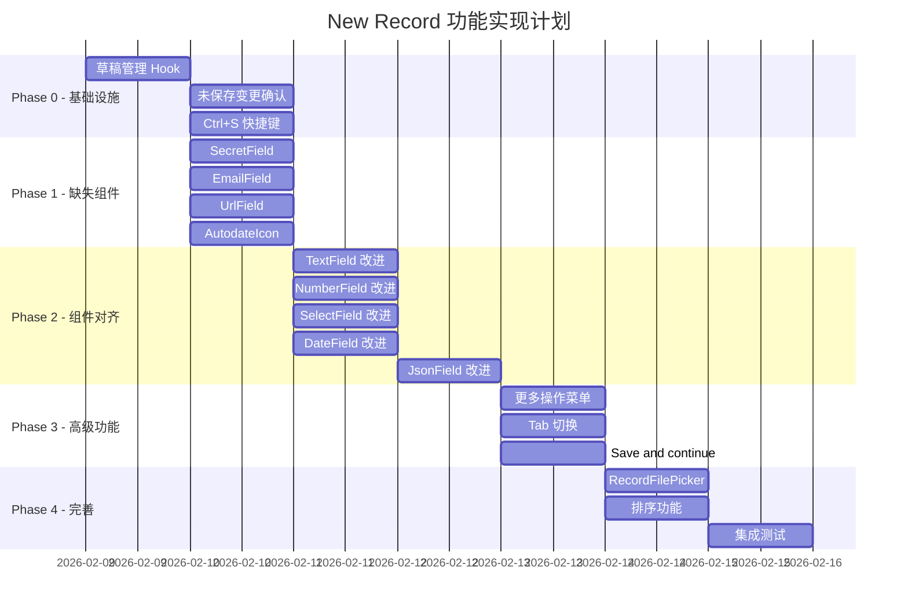

# Feature Specification: WebUI New Record 功能 1:1 对齐

**Feature Branch**: `032-webui-new-record-alignment`  
**Created**: 2026-02-09  
**Status**: Ready for Dev  
**Parent Spec**: `specs/014-ui-svelte-to-react/spec.md`

## 1. Problem Essence (核心问题)

WebUI (React) 版本的 New Record 功能需要与 UI (Svelte) 版本进行深度对比分析，确保所有交互、表单展示、校验规则和功能点完全一致。

**目标**：确保 New Record 面板的**所有交互、表单字段、校验逻辑**与 UI 版本保持 1:1 一致。

---

## 2. UI 版本架构分析

### 2.1 核心组件结构

```
RecordUpsertPanel.svelte (主面板)
├── OverlayPanel (基础弹窗容器)
├── Header 区域
│   ├── 标题: "New/Edit {collection.name} record"
│   ├── 更多操作下拉菜单 (编辑模式)
│   │   ├── Send verification email
│   │   ├── Send password reset email
│   │   ├── Impersonate
│   │   ├── Copy raw JSON
│   │   ├── Duplicate
│   │   └── Delete
│   └── Tab 切换 (Auth Collection 编辑模式)
│       ├── Account Tab
│       └── Authorized providers Tab
├── Form 区域
│   ├── ID 字段 (只读/可输入)
│   ├── AuthFields (Auth Collection)
│   │   ├── email (带 Public 切换)
│   │   ├── password + passwordConfirm
│   │   └── verified (切换)
│   ├── 动态字段列表 (根据 collection.fields)
│   │   ├── TextField
│   │   ├── NumberField
│   │   ├── BoolField
│   │   ├── EmailField
│   │   ├── UrlField
│   │   ├── EditorField (TinyMCE)
│   │   ├── DateField (Flatpickr)
│   │   ├── SelectField
│   │   ├── JsonField (CodeEditor)
│   │   ├── FileField (拖拽上传)
│   │   ├── RelationField (RecordsPicker)
│   │   ├── PasswordField
│   │   ├── SecretField
│   │   └── GeoPointField (Leaflet Map)
│   └── ExternalAuthsList (Auth 编辑模式)
└── Footer 区域
    ├── Cancel 按钮
    ├── Create/Save changes 按钮
    └── Save and continue 下拉 (编辑模式)
```

### 2.2 关键文件映射

| UI (Svelte) | WebUI (React) | 状态 |
|-------------|---------------|------|
| `RecordUpsertPanel.svelte` | `UpsertPanel.tsx` | ⚠️ 部分实现 |
| `fields/AuthFields.svelte` | `fields/AuthFields.tsx` | ⚠️ 需对齐 |
| `fields/TextField.svelte` | `fields/TextField.tsx` | ⚠️ 需对齐 |
| `fields/NumberField.svelte` | `fields/NumberField.tsx` | ⚠️ 需对齐 |
| `fields/BoolField.svelte` | `fields/BoolField.tsx` | ⚠️ 需对齐 |
| `fields/EmailField.svelte` | ❌ 缺失 | 🔴 缺失 |
| `fields/UrlField.svelte` | ❌ 缺失 | 🔴 缺失 |
| `fields/EditorField.svelte` | `fields/EditorField.tsx` | ⚠️ 需对齐 |
| `fields/DateField.svelte` | `fields/DateField.tsx` | ⚠️ 需对齐 |
| `fields/SelectField.svelte` | `fields/SelectField.tsx` | ⚠️ 需对齐 |
| `fields/JsonField.svelte` | `fields/JsonField.tsx` | ⚠️ 需对齐 |
| `fields/FileField.svelte` | `fields/FileField.tsx` | ⚠️ 需对齐 |
| `fields/RelationField.svelte` | `fields/RelationField.tsx` | ⚠️ 需对齐 |
| `fields/PasswordField.svelte` | `fields/PasswordField.tsx` | ⚠️ 需对齐 |
| `fields/SecretField.svelte` | ❌ 缺失 | 🔴 缺失 |
| `fields/GeoPointField.svelte` | `fields/GeoPointField.tsx` | ⚠️ 需对齐 |
| `fields/FieldLabel.svelte` | `fields/FieldLabel.tsx` | ✅ 已存在 |
| `AutodateIcon.svelte` | ❌ 缺失 | 🔴 缺失 |
| `ExternalAuthsList.svelte` | `ExternalAuthsList.tsx` | ✅ 已存在 |
| `ImpersonatePopup.svelte` | `ImpersonatePopup.tsx` | ✅ 已存在 |
| `RecordsPicker.svelte` | `RecordsPicker.tsx` | ✅ 已存在 |
| `RecordFilePicker.svelte` | ❌ 缺失 | 🔴 缺失 |

---

## 3. 功能对比详细分析

### 3.1 面板基础交互

| 功能点 | UI (Svelte) | WebUI (React) | 状态 |
|--------|-------------|---------------|------|
| **面板标题** | "New/Edit {collection.name} record" | "新建记录/编辑记录" | 🔴 未对齐 |
| **面板宽度** | `overlay-panel-lg` (有 editor 字段时 `overlay-panel-xl`) | 固定 `width="lg"` | 🔴 未对齐 |
| **ESC 关闭** | ✅ `escClose={!isLoading}` | ⚠️ 需验证 | ⚠️ 待验证 |
| **点击遮罩关闭** | ✅ `overlayClose={!isLoading}` | ⚠️ 需验证 | ⚠️ 待验证 |
| **未保存变更确认** | ✅ `beforeHide` 钩子 | ❌ 缺失 | 🔴 缺失 |
| **草稿自动保存** | ✅ localStorage 草稿 | ❌ 缺失 | 🔴 缺失 |
| **草稿恢复提示** | ✅ "Restore draft" 提示 | ❌ 缺失 | 🔴 缺失 |
| **Ctrl+S 快捷键** | ✅ `handleFormKeydown` | ❌ 缺失 | 🔴 缺失 |

### 3.2 Header 区域

| 功能点 | UI (Svelte) | WebUI (React) | 状态 |
|--------|-------------|---------------|------|
| **Loading 状态** | ✅ `<span class="loader loader-sm" />` | ⚠️ 需验证 | ⚠️ 待验证 |
| **更多操作按钮** | ✅ 编辑模式显示 | ❌ 缺失 | 🔴 缺失 |
| **发送验证邮件** | ✅ Auth + 未验证 + 有邮箱 | ❌ 缺失 | 🔴 缺失 |
| **发送密码重置邮件** | ✅ Auth + 有邮箱 | ❌ 缺失 | 🔴 缺失 |
| **模拟用户** | ✅ Auth Collection | ❌ 缺失 | 🔴 缺失 |
| **复制 JSON** | ✅ 所有记录 | ❌ 缺失 | 🔴 缺失 |
| **复制记录** | ✅ 编辑模式 | ❌ 缺失 | 🔴 缺失 |
| **删除记录** | ✅ 编辑模式 | ❌ 缺失 | 🔴 缺失 |
| **Tab 切换** | ✅ Auth 编辑模式 (Account/Providers) | ❌ 缺失 | 🔴 缺失 |

### 3.3 ID 字段

| 功能点 | UI (Svelte) | WebUI (React) | 状态 |
|--------|-------------|---------------|------|
| **字段图标** | ✅ `ri-key-line` | ⚠️ 需验证 | ⚠️ 待验证 |
| **新建时可编辑** | ✅ `readonly={!isNew}` | ⚠️ 需验证 | ⚠️ 待验证 |
| **编辑时只读** | ✅ readonly 属性 | ✅ disabled 属性 | ✅ 已对齐 |
| **自动生成提示** | ✅ "Leave empty to auto generate..." | ❌ 缺失 | 🔴 缺失 |
| **AutodateIcon** | ✅ 显示 created/updated 时间 | ❌ 缺失 | 🔴 缺失 |
| **min/max 长度** | ✅ 从 idField 获取 | ❌ 缺失 | 🔴 缺失 |

### 3.4 Auth Collection 特殊字段 (AuthFields)

| 功能点 | UI (Svelte) | WebUI (React) | 状态 |
|--------|-------------|---------------|------|
| **email 字段** | ✅ type="email" | ✅ | ✅ 已对齐 |
| **email 必填** | ✅ required={emailField.required} | ⚠️ 需验证 | ⚠️ 待验证 |
| **email autofocus** | ✅ autofocus={isNew} | ❌ 缺失 | 🔴 缺失 |
| **email 公开切换** | ✅ "Public: On/Off" 按钮 | ⚠️ 需验证样式 | ⚠️ 待验证 |
| **superusers 无公开切换** | ✅ `{#if !isSuperusers}` | ⚠️ 需验证 | ⚠️ 待验证 |
| **Change password 切换** | ✅ 编辑模式显示 | ⚠️ 需验证 | ⚠️ 待验证 |
| **password 必填** | ✅ 新建时必填 | ⚠️ 需验证 | ⚠️ 待验证 |
| **passwordConfirm** | ✅ 与 password 配对 | ⚠️ 需验证 | ⚠️ 待验证 |
| **密码生成按钮** | ✅ SecretGeneratorButton | ❌ 缺失 | 🔴 缺失 |
| **verified 切换** | ✅ checkbox + 确认弹窗 | ⚠️ 需验证确认逻辑 | ⚠️ 待验证 |
| **superusers 无 verified** | ✅ `{#if !isSuperusers}` | ⚠️ 需验证 | ⚠️ 待验证 |

### 3.5 字段类型详细分析

#### 3.5.1 TextField (text)

| 功能点 | UI (Svelte) | WebUI (React) | 状态 |
|--------|-------------|---------------|------|
| **组件类型** | AutoExpandTextarea | Input | 🔴 未对齐 |
| **自动扩展高度** | ✅ | ❌ | 🔴 缺失 |
| **自动生成提示** | ✅ "Leave empty to autogenerate..." | ❌ 缺失 | 🔴 缺失 |
| **required 逻辑** | ✅ `field.required && !hasAutogenerate` | ⚠️ 需验证 | ⚠️ 待验证 |
| **FieldLabel** | ✅ 带图标和标签 | ⚠️ 需验证 | ⚠️ 待验证 |

#### 3.5.2 NumberField (number)

| 功能点 | UI (Svelte) | WebUI (React) | 状态 |
|--------|-------------|---------------|------|
| **type** | ✅ type="number" | ✅ type="number" | ✅ 已对齐 |
| **min/max** | ✅ field.min/field.max | ❌ 缺失 | 🔴 缺失 |
| **step** | ✅ step="any" | ❌ 缺失 | 🔴 缺失 |
| **required** | ✅ field.required | ⚠️ 需验证 | ⚠️ 待验证 |

#### 3.5.3 BoolField (bool)

| 功能点 | UI (Svelte) | WebUI (React) | 状态 |
|--------|-------------|---------------|------|
| **组件类型** | checkbox + FieldLabel | Checkbox + Label | ✅ 已对齐 |
| **form-field-toggle 样式** | ✅ | ⚠️ 需验证样式 | ⚠️ 待验证 |
| **默认值** | ✅ value = false | ⚠️ 需验证 | ⚠️ 待验证 |

#### 3.5.4 EmailField (email) - WebUI 缺失

| 功能点 | UI (Svelte) | WebUI (React) | 状态 |
|--------|-------------|---------------|------|
| **独立组件** | ✅ EmailField.svelte | ❌ inline 实现 | 🔴 缺失 |
| **type** | ✅ type="email" | ⚠️ 需验证 | ⚠️ 待验证 |
| **required** | ✅ field.required | ⚠️ 需验证 | ⚠️ 待验证 |
| **FieldLabel** | ✅ | ⚠️ 需验证 | ⚠️ 待验证 |

#### 3.5.5 UrlField (url) - WebUI 缺失

| 功能点 | UI (Svelte) | WebUI (React) | 状态 |
|--------|-------------|---------------|------|
| **独立组件** | ✅ UrlField.svelte | ❌ inline 实现 | 🔴 缺失 |
| **type** | ✅ type="url" | ⚠️ 需验证 | ⚠️ 待验证 |
| **required** | ✅ field.required | ⚠️ 需验证 | ⚠️ 待验证 |
| **FieldLabel** | ✅ | ⚠️ 需验证 | ⚠️ 待验证 |

#### 3.5.6 EditorField (editor)

| 功能点 | UI (Svelte) | WebUI (React) | 状态 |
|--------|-------------|---------------|------|
| **编辑器** | TinyMCE | TinyMCE | ✅ 已对齐 |
| **延迟加载** | ✅ 100ms timeout | ⚠️ 需验证 | ⚠️ 待验证 |
| **convert_urls** | ✅ field.convertURLs | ❌ 缺失 | 🔴 缺失 |
| **图片选择器** | ✅ RecordFilePicker | ❌ 缺失 | 🔴 缺失 |
| **form-field-editor 样式** | ✅ | ⚠️ 需验证 | ⚠️ 待验证 |

#### 3.5.7 DateField (date)

| 功能点 | UI (Svelte) | WebUI (React) | 状态 |
|--------|-------------|---------------|------|
| **日期选择器** | Flatpickr (svelte-flatpickr) | Input type="datetime-local" | 🔴 未对齐 |
| **格式** | "Y-m-d H:i:S" | ISO 格式 | 🔴 未对齐 |
| **24小时制** | ✅ time_24hr: true | ⚠️ 需验证 | ⚠️ 待验证 |
| **秒支持** | ✅ enableSeconds: true | ❌ 缺失 | 🔴 缺失 |
| **清除按钮** | ✅ 非必填时显示 | ❌ 缺失 | 🔴 缺失 |
| **手动输入** | ✅ allowInput: true | ⚠️ 需验证 | ⚠️ 待验证 |

#### 3.5.8 SelectField (select)

| 功能点 | UI (Svelte) | WebUI (React) | 状态 |
|--------|-------------|---------------|------|
| **单选/多选** | ✅ maxSelect 判断 | ⚠️ 需验证 | ⚠️ 待验证 |
| **可搜索** | ✅ items.length > 5 | ❌ 缺失 | 🔴 缺失 |
| **toggle** | ✅ !required \|\| isMultiple | ⚠️ 需验证 | ⚠️ 待验证 |
| **最大选择限制** | ✅ maxSelect 验证 | ⚠️ 需验证 | ⚠️ 待验证 |
| **值过滤** | ✅ 过滤不存在的选项 | ❌ 缺失 | 🔴 缺失 |
| **帮助文本** | ✅ "Select up to {maxSelect} items." | ❌ 缺失 | 🔴 缺失 |

#### 3.5.9 JsonField (json)

| 功能点 | UI (Svelte) | WebUI (React) | 状态 |
|--------|-------------|---------------|------|
| **编辑器** | CodeEditor (动态加载) | textarea | 🔴 未对齐 |
| **语法高亮** | ✅ language="json" | ❌ 缺失 | 🔴 缺失 |
| **JSON 校验状态** | ✅ 图标显示有效/无效 | ❌ 缺失 | 🔴 缺失 |
| **最大高度** | ✅ maxHeight="500" | ❌ 缺失 | 🔴 缺失 |
| **值序列化** | ✅ JSON.stringify 格式化 | ⚠️ 需验证 | ⚠️ 待验证 |

#### 3.5.10 FileField (file)

| 功能点 | UI (Svelte) | WebUI (React) | 状态 |
|--------|-------------|---------------|------|
| **拖拽上传** | ✅ dragover/drop 事件 | ⚠️ 需验证 | ⚠️ 待验证 |
| **多文件支持** | ✅ maxSelect > 1 | ⚠️ 需验证 | ⚠️ 待验证 |
| **文件预览** | ✅ RecordFileThumb | ⚠️ 需验证 | ⚠️ 待验证 |
| **新文件预览** | ✅ UploadedFilePreview | ⚠️ 需验证 | ⚠️ 待验证 |
| **删除/恢复** | ✅ deletedFileNames 数组 | ⚠️ 需验证 | ⚠️ 待验证 |
| **文件排序** | ✅ Draggable 组件 | ❌ 缺失 | 🔴 缺失 |
| **MIME 类型限制** | ✅ accept={mimeTypes} | ⚠️ 需验证 | ⚠️ 待验证 |
| **最大数量限制** | ✅ maxReached 禁用上传 | ⚠️ 需验证 | ⚠️ 待验证 |
| **在新标签打开** | ✅ openInNewTab 函数 | ❌ 缺失 | 🔴 缺失 |
| **文件 Token** | ✅ getSuperuserFileToken | ⚠️ 需验证 | ⚠️ 待验证 |

#### 3.5.11 RelationField (relation)

| 功能点 | UI (Svelte) | WebUI (React) | 状态 |
|--------|-------------|---------------|------|
| **记录选择器** | ✅ RecordsPicker | ✅ RecordsPicker | ✅ 已对齐 |
| **批量加载** | ✅ batchSize = 100 | ⚠️ 需验证 | ⚠️ 待验证 |
| **关联展开** | ✅ expand presentable fields | ⚠️ 需验证 | ⚠️ 待验证 |
| **无效 ID 提示** | ✅ invalidIds 警告图标 | ❌ 缺失 | 🔴 缺失 |
| **排序支持** | ✅ Draggable + listToValue | ❌ 缺失 | 🔴 缺失 |
| **Skeleton 加载** | ✅ isLoading 占位符 | ⚠️ 需验证 | ⚠️ 待验证 |
| **删除按钮** | ✅ remove 函数 | ⚠️ 需验证 | ⚠️ 待验证 |

#### 3.5.12 PasswordField (password) - 非 Auth 的 password 字段

| 功能点 | UI (Svelte) | WebUI (React) | 状态 |
|--------|-------------|---------------|------|
| **type** | ✅ type="password" | ✅ type="password" | ✅ 已对齐 |
| **autocomplete** | ✅ autocomplete="new-password" | ⚠️ 需验证 | ⚠️ 待验证 |
| **required** | ✅ field.required | ⚠️ 需验证 | ⚠️ 待验证 |

#### 3.5.13 SecretField (secret) - WebUI 缺失

| 功能点 | UI (Svelte) | WebUI (React) | 状态 |
|--------|-------------|---------------|------|
| **独立组件** | ✅ SecretField.svelte | ❌ 缺失 | 🔴 缺失 |
| **SecretInput** | ✅ 使用 SecretInput 组件 | ❌ 缺失 | 🔴 缺失 |
| **required** | ✅ field.required | ❌ 缺失 | 🔴 缺失 |

#### 3.5.14 GeoPointField (geoPoint)

| 功能点 | UI (Svelte) | WebUI (React) | 状态 |
|--------|-------------|---------------|------|
| **经纬度输入** | ✅ lon/lat 数字输入 | ✅ | ✅ 已对齐 |
| **范围限制** | ✅ lon: -180~180, lat: -90~90 | ⚠️ 需验证 | ⚠️ 待验证 |
| **地图切换** | ✅ Toggle map 按钮 | ⚠️ 需验证 | ⚠️ 待验证 |
| **Leaflet 地图** | ✅ 动态加载 Leaflet | ✅ LeafletMap | ✅ 已对齐 |
| **默认值** | ✅ { lat: 0, lon: 0 } | ⚠️ 需验证 | ⚠️ 待验证 |

### 3.6 Footer 区域

| 功能点 | UI (Svelte) | WebUI (React) | 状态 |
|--------|-------------|---------------|------|
| **Cancel 按钮** | ✅ disabled={isSaving \|\| isLoading} | ✅ | ✅ 已对齐 |
| **Create 按钮** | ✅ 新建模式 | ✅ | ✅ 已对齐 |
| **Save changes 按钮** | ✅ 编辑模式 | ✅ | ✅ 已对齐 |
| **Save and continue** | ✅ 下拉菜单 (编辑模式) | ❌ 缺失 | 🔴 缺失 |
| **禁用逻辑** | ✅ !canSave \|\| isSaving | ⚠️ 需验证 | ⚠️ 待验证 |
| **加载状态** | ✅ btn-loading 类 | ⚠️ 需验证 | ⚠️ 待验证 |

### 3.7 数据处理逻辑

#### 3.7.1 表单数据导出 (exportFormData)

| 功能点 | UI (Svelte) | WebUI (React) | 状态 |
|--------|-------------|---------------|------|
| **FormData 格式** | ✅ | ⚠️ 需验证 | ⚠️ 待验证 |
| **跳过 autodate 字段** | ✅ | ⚠️ 需验证 | ⚠️ 待验证 |
| **Auth password 特殊处理** | ✅ 仅显式设置时导出 | ⚠️ 需验证 | ⚠️ 待验证 |
| **JSON 字段验证** | ✅ 抛出 ClientResponseError | ❌ 缺失 | 🔴 缺失 |
| **undefined 转 null** | ✅ | ⚠️ 需验证 | ⚠️ 待验证 |
| **文件上传** | ✅ key+ 语法 | ⚠️ 需验证 | ⚠️ 待验证 |
| **文件删除** | ✅ key- 语法 | ⚠️ 需验证 | ⚠️ 待验证 |

#### 3.7.2 草稿管理

| 功能点 | UI (Svelte) | WebUI (React) | 状态 |
|--------|-------------|---------------|------|
| **草稿键格式** | ✅ `record_draft_{collectionId}_{recordId}` | ❌ 缺失 | 🔴 缺失 |
| **自动保存** | ✅ 监听 serializedData 变化 | ❌ 缺失 | 🔴 缺失 |
| **恢复草稿** | ✅ initialDraft + restoreDraft | ❌ 缺失 | 🔴 缺失 |
| **删除草稿** | ✅ 保存/关闭时清理 | ❌ 缺失 | 🔴 缺失 |
| **草稿比较** | ✅ areRecordsEqual 排除文件字段 | ❌ 缺失 | 🔴 缺失 |

#### 3.7.3 变更检测

| 功能点 | UI (Svelte) | WebUI (React) | 状态 |
|--------|-------------|---------------|------|
| **数据变更** | ✅ JSON.stringify 比较 | ⚠️ 需验证 | ⚠️ 待验证 |
| **文件变更** | ✅ uploadedFilesMap + deletedFileNamesMap | ⚠️ 需验证 | ⚠️ 待验证 |
| **hasChanges** | ✅ hasFileChanges \|\| serializedData 变化 | ⚠️ 需验证 | ⚠️ 待验证 |

### 3.8 特殊功能

#### 3.8.1 Duplicate (复制记录)

| 功能点 | UI (Svelte) | WebUI (React) | 状态 |
|--------|-------------|---------------|------|
| **未保存变更确认** | ✅ | ❌ 缺失 | 🔴 缺失 |
| **重置文件字段** | ✅ | ❌ 缺失 | 🔴 缺失 |
| **重置 autodate 字段** | ✅ | ❌ 缺失 | 🔴 缺失 |
| **清空 ID** | ✅ clone.id = "" | ❌ 缺失 | 🔴 缺失 |
| **删除草稿** | ✅ | ❌ 缺失 | 🔴 缺失 |
| **标记 hasChanges** | ✅ originalSerializedData = "" | ❌ 缺失 | 🔴 缺失 |

#### 3.8.2 密码变更注销

| 功能点 | UI (Svelte) | WebUI (React) | 状态 |
|--------|-------------|---------------|------|
| **superusers 密码变更** | ✅ 自动注销当前用户 | ❌ 缺失 | 🔴 缺失 |

---

## 4. FieldLabel 组件规范

### 4.1 字段类型图标映射

```typescript
const FIELD_TYPE_ICONS: Record<string, string> = {
  primary: 'ri-key-line',
  text: 'ri-text',
  number: 'ri-hashtag',
  date: 'ri-calendar-line',
  bool: 'ri-toggle-line',
  email: 'ri-mail-line',
  url: 'ri-link',
  editor: 'ri-edit-2-line',
  select: 'ri-list-check',
  json: 'ri-braces-line',
  file: 'ri-image-line',
  relation: 'ri-mind-map',
  password: 'ri-lock-password-line',
  autodate: 'ri-calendar-check-line',
  geoPoint: 'ri-map-pin-2-line',
  secret: 'ri-shield-keyhole-line',
}
```

### 4.2 FieldLabel 渲染逻辑

```tsx
<label htmlFor={uniqueId}>
  {icon && (
    <i className={field.primaryKey 
      ? getFieldTypeIcon('primary') 
      : getFieldTypeIcon(field.type)} 
    />
  )}
  <span className="txt">{field.name}</span>
  {field.hidden && (
    <small className="label label-sm label-danger">Hidden</small>
  )}
  {children}
</label>
```

---

## 5. 校验规则汇总

### 5.1 客户端校验

| 字段类型 | 校验规则 |
|----------|----------|
| id | minlength/maxlength 来自 idField |
| text | required 且无 autogeneratePattern 时必填 |
| number | required + min/max |
| email | required + type="email" 原生校验 |
| url | required + type="url" 原生校验 |
| password | required (新建时) |
| passwordConfirm | required (新建时) |
| date | required |
| select | required + maxSelect 限制 |
| json | JSON.parse 有效性校验 |
| file | required + maxSelect 限制 |
| relation | required |
| geoPoint | lat: -90~90, lon: -180~180 |

### 5.2 服务端校验 (通过 API 返回错误)

| 错误类型 | 处理方式 |
|----------|----------|
| 字段级错误 | 显示在对应字段下方 |
| 表单级错误 | 显示在表单顶部 |
| JSON 校验错误 | 本地抛出 ClientResponseError |

---

## 6. API 调用规范

### 6.1 创建记录

```typescript
await ApiClient.collection(collectionId).create(formData)
```

### 6.2 更新记录

```typescript
await ApiClient.collection(collectionId).update(recordId, formData)
```

### 6.3 删除记录

```typescript
await ApiClient.collection(collectionId).delete(recordId)
```

### 6.4 发送验证邮件

```typescript
await ApiClient.collection(collectionId).requestVerification(email)
```

### 6.5 发送密码重置邮件

```typescript
await ApiClient.collection(collectionId).requestPasswordReset(email)
```

### 6.6 模拟用户

```typescript
await ApiClient.collection(collectionName).impersonate(recordId, duration)
```

### 6.7 获取文件 Token

```typescript
await ApiClient.getSuperuserFileToken(collectionId)
```

---

## 7. 事件回调规范

| 事件 | 参数 | 说明 |
|------|------|------|
| onSave | { isNew: boolean, record: RecordModel } | 保存成功 |
| onDelete | record: RecordModel | 删除成功 |
| onShow | - | 面板显示 |
| onHide | - | 面板隐藏 |

---

## 8. 需要实现的缺失功能列表

### 8.1 高优先级 (P0)

1. **草稿自动保存/恢复** - 用户体验关键功能
2. **未保存变更确认** - 防止数据丢失
3. **Ctrl+S 快捷键** - 提升效率
4. **更多操作菜单** - 编辑模式核心功能
5. **SecretField 组件** - 字段类型完整性
6. **EmailField 组件** - 字段类型完整性
7. **UrlField 组件** - 字段类型完整性

### 8.2 中优先级 (P1)

1. **DateField 改用 Flatpickr** - UI 一致性
2. **JsonField 改用 CodeEditor** - UI 一致性
3. **Save and continue 按钮** - 编辑效率
4. **Tab 切换 (Auth)** - Auth 记录管理
5. **AutodateIcon 组件** - 时间信息展示
6. **RecordFilePicker** - 编辑器图片选择

### 8.3 低优先级 (P2)

1. **面板宽度动态调整** - editor 字段时变宽
2. **关联字段排序** - 多选时排序
3. **文件字段排序** - 多选时排序
4. **无效关联 ID 提示** - 数据完整性提示

---

## 9. 测试覆盖要求

### 9.1 单元测试 (80% 覆盖率)

| 组件/函数 | 测试要点 |
|-----------|----------|
| UpsertPanel | 新建/编辑模式切换、表单提交、草稿管理 |
| AuthFields | email/password 字段、verified 切换 |
| TextField | autogenerate 逻辑、required 逻辑 |
| NumberField | min/max 校验 |
| SelectField | 单选/多选、maxSelect 限制 |
| JsonField | JSON 有效性校验 |
| FileField | 上传/删除/排序 |
| RelationField | 选择/删除/排序 |
| GeoPointField | 经纬度范围校验 |
| exportFormData | FormData 构建逻辑 |
| 草稿管理函数 | save/restore/delete draft |

### 9.2 集成测试

| 场景 | 测试要点 |
|------|----------|
| 创建 Base Collection 记录 | 所有字段类型 |
| 创建 Auth Collection 记录 | email/password/verified |
| 编辑记录 | 数据加载、变更保存 |
| 删除记录 | 确认弹窗、刷新列表 |
| 草稿恢复 | localStorage 操作 |
| 文件上传 | FormData 构建 |

---

## 10. 实现顺序建议



---

## 11. 附录

### 11.1 字段跳过规则

```typescript
// 基础跳过字段
const BASE_SKIP_FIELD_NAMES = ['id']

// Auth Collection 额外跳过字段 (由 AuthFields 处理)
const AUTH_SKIP_FIELD_NAMES = [
  ...BASE_SKIP_FIELD_NAMES,
  'email',
  'emailVisibility',
  'verified',
  'tokenKey',
  'password',
]

// 动态过滤
const skipFieldNames = isAuthCollection ? AUTH_SKIP_FIELD_NAMES : BASE_SKIP_FIELD_NAMES
const regularFields = collection?.fields?.filter(
  f => !skipFieldNames.includes(f.name) && f.type !== 'autodate'
) || []
```

### 11.2 Flatpickr 配置

```typescript
const defaultFlatpickrOptions = {
  dateFormat: 'Y-m-d H:i:S',
  disableMobile: true,
  allowInput: true,
  enableTime: true,
  enableSeconds: true,
  time_24hr: true,
  locale: {
    firstDayOfWeek: 1,
  },
}
```

### 11.3 TinyMCE 配置

```typescript
const editorConfig = {
  convert_urls: field.convertURLs,
  relative_urls: false,
  // ... 其他 defaultEditorOptions
}
```

---

## 12. 遗漏功能点补充 (2026-02-09 审查发现)

### 12.1 View Collection 不支持 New Record

**重要发现**：View Collection（视图类型集合）**不能**使用 RecordUpsertPanel 创建或编辑记录。

```typescript
// PageRecords.svelte 核心逻辑
$activeCollection.type === "view"
  ? recordPreviewPanel?.show(showModel)  // View Collection 只能预览
  : recordUpsertPanel?.show(showModel);  // 其他类型可以编辑
```

**WebUI 需要实现**：
- View Collection 的 "New record" 按钮应该**不显示**或**禁用**
- 点击 View Collection 记录时只能打开 RecordPreviewPanel

### 12.2 Hidden 字段标签显示

隐藏字段需要在 FieldLabel 中显示红色标签：

```svelte
<!-- FieldLabel.svelte -->
{#if field.hidden}
    <small class="label label-sm label-danger">Hidden</small>
{/if}
```

**WebUI 需要实现**：在 FieldLabel 组件中添加 Hidden 标签显示

### 12.3 Verified 变更确认弹窗详细逻辑

```typescript
// AuthFields.svelte 中的 verified checkbox 处理
on:change|preventDefault={(e) => {
    if (isNew) {
        return; // 新建时：不需要确认，直接允许变更
    }
    confirm(
        `Do you really want to manually change the verified account state?`,
        () => {},  // 确认：保持变更后的状态
        () => {
            record.verified = !e.target.checked;  // 取消：还原 checkbox 状态
        },
    );
}}
```

**边界情况**：
- 新建记录时：不显示确认弹窗
- 编辑记录时：必须显示确认弹窗
- 用户取消时：必须还原 checkbox 状态

### 12.4 Select 字段值自动过滤和截断

```typescript
// SelectField.svelte 的值处理逻辑
$: if (isMultiple && Array.isArray(value)) {
    // 1. 过滤不存在的选项（可能是配置变更后遗留的无效值）
    value = value.filter((v) => field.values.includes(v));
    
    // 2. 超过 maxSelect 时从后面截断（保留最新选择的）
    if (value.length > maxSelect) {
        value = value.slice(value.length - maxSelect);
    }
}
```

**边界情况**：
- 当 field.values 配置变更后，已保存的记录可能包含不存在的选项
- 需要在加载时自动清理这些无效值
- 截断时保留"最后选择的"值，而不是"最先选择的"

### 12.5 ExternalAuthsList 删除确认

删除 OAuth Provider 关联需要确认弹窗：

```typescript
// ExternalAuthsList.svelte
confirm(`Do you really want to unlink the "${provider}" provider?`, async () => {
    await pb.collection(collection.id).unlinkExternalAuth(record.id, provider);
    // 刷新列表
});
```

---

## 13. 需求模糊点说明

### 13.1 ID 字段的 autogeneratePattern

**模糊点**：什么时候显示 "Leave empty to auto generate..." 提示？

**明确规则**：
```typescript
// idField 获取逻辑
const idField = collection?.fields?.find(f => f.name === 'id');

// 显示提示的条件
const showAutogenerateHint = idField?.autogeneratePattern && isNew;
```

**注意**：idField 的 min/max 长度限制从 collection.fields 中的 id 字段配置获取

### 13.2 File 字段的 maxSize 校验

**模糊点**：客户端是否需要前置校验文件大小？

**建议规则**：
- **客户端**：不做前置校验（文件大小限制可能较大，前端读取文件获取大小会影响性能）
- **服务端**：返回 400 错误时在字段下方显示错误信息
- **备选方案**：如果需要客户端校验，使用 `File.size` 属性比较

### 13.3 File 字段的 mimeTypes 校验

**明确规则**：
```typescript
// 将 field.mimeTypes 转换为 input accept 属性
const accept = field.mimeTypes?.length > 0 
  ? field.mimeTypes.join(',') 
  : undefined;
```

**注意**：accept 属性只是浏览器提示，用户仍可选择其他类型文件，服务端会进行最终校验

### 13.4 GeoPoint 字段的地图初始位置

**明确规则**：
- 有值时：显示该坐标位置
- 无值时（新建）：显示默认坐标 `{ lat: 0, lon: 0 }` 即赤道和本初子午线交点
- 不使用用户地理位置（需要授权，可能被拒绝）

---

## 14. 边界情况处理

### 14.1 空 Collection（无自定义字段）

**场景**：只有系统字段（id, created, updated）的 Collection

**处理方式**：
- 正常显示 id 字段
- 正常显示 "Create" / "Save changes" 按钮
- Auth Collection 仍显示 email/password/verified 字段

### 14.2 大量字段的 Collection

**场景**：超过 50 个字段的 Collection

**当前处理**：无特殊处理，所有字段线性显示

**未来优化建议**：
- 考虑字段分组（按类型或按配置）
- 考虑虚拟滚动优化性能

### 14.3 超长字段名

**处理方式**：
- FieldLabel 使用 `text-overflow: ellipsis` 截断
- 完整字段名通过 title 属性显示

### 14.4 网络错误处理

**场景**：
1. 保存时网络断开
2. 文件上传超时
3. API 返回 500 错误

**处理方式**：
- 显示通用错误提示 toast
- 保持表单数据不丢失
- 用户可以重试保存

**不需要实现**：
- 自动重试
- 离线保存

### 14.5 并发编辑

**场景**：两个用户同时编辑同一条记录

**当前处理**：后保存的覆盖先保存的（Last Write Wins）

**不需要实现**：
- 乐观锁
- 版本控制
- 冲突提示

### 14.6 Superusers Collection 特殊处理汇总

| 功能点 | 普通 Auth | Superusers |
|--------|-----------|------------|
| email Public 切换 | ✅ 显示 | ❌ 不显示 |
| verified 字段 | ✅ 显示 | ❌ 不显示 |
| Tab 切换 (Providers) | ✅ 显示 | ❌ 不显示 |
| 密码变更后注销 | ❌ 不注销 | ✅ 自动注销当前用户 |

---

## 15. RecordsPicker 和 RecordFilePicker 中的 RecordUpsertPanel

**重要**：RecordUpsertPanel 不仅在 PageRecords 中使用，还嵌套在以下组件中：

### 15.1 RecordsPicker（关系字段选择器）

```svelte
<!-- RecordsPicker.svelte -->
<RecordUpsertPanel
    bind:this={upsertPanel}
    {collection}
    on:save={(e) => {
        // 保存后：更新列表 + 自动选中新记录
        CommonHelper.removeByKey(list, "id", e.detail.record.id);
        list.unshift(e.detail.record);
        select(e.detail.record);
        reloadRecord(e.detail.record);
    }}
    on:delete={(e) => {
        // 删除后：从列表移除 + 取消选中
        CommonHelper.removeByKey(list, "id", e.detail.id);
        deselect(e.detail);
    }}
/>
```

**功能**：在选择关联记录时可以直接创建新记录

### 15.2 RecordFilePicker（编辑器图片选择器）

```svelte
<!-- RecordFilePicker.svelte -->
<RecordUpsertPanel
    bind:this={upsertPanel}
    collection={selectedCollection}
    on:save={(e) => {
        // 保存后：更新列表 + 自动选中第一个图片
        CommonHelper.removeByKey(list, "id", e.detail.record.id);
        list.unshift(e.detail.record);
        const names = extractFiles(e.detail.record);
        if (names.length > 0) {
            select(e.detail.record, names[0]);
        }
    }}
    on:delete={(e) => {
        // 删除后：清空选中 + 从列表移除
        if (selectedFile?.record?.id == e.detail.id) {
            selectedFile = {};
        }
        CommonHelper.removeByKey(list, "id", e.detail.id);
    }}
/>
```

**功能**：在编辑器中选择图片时可以直接创建带图片的新记录

### 15.3 对 WebUI 的影响

RecordUpsertPanel 需要支持作为子组件嵌套使用，需要正确处理：
- onSave 回调返回完整的 record 对象
- onDelete 回调返回被删除记录的信息
- 嵌套面板的 z-index 层级

---

## 16. 表单校验详细规范 (2026-02-09 补充)

### 16.1 UI 版本表单校验机制分析

#### 16.1.1 错误存储架构

UI 版本使用全局 errors store 管理表单错误：

```javascript
// ui/src/stores/errors.js
import { writable } from "svelte/store";

// errors 是一个扁平的键值对象
// key: 字段名 (如 "email", "password", "metadata")
// value: 错误信息对象 { code, message }
export const errors = writable({});

// 设置错误
export function setErrors(err) {
    errors.set(err || {});
}

// 清除错误
export function clearErrors() {
    errors.set({});
}
```

#### 16.1.2 Field 组件错误显示

UI 版本的 Field.svelte 组件自动从 errors store 读取并显示错误：

```svelte
<!-- ui/src/components/base/Field.svelte -->
<script>
    import { errors } from "@/stores/errors";
    
    export let name = "";
    
    // 自动查找匹配当前字段的错误
    // 支持嵌套路径如 "data.metadata.name"
    $: fieldError = CommonHelper.getNestedVal($errors, name);
</script>

<div class="form-field" class:error={fieldError}>
    <slot />
    
    {#if fieldError?.message}
        <div class="help-block help-block-error">
            {fieldError.message}
        </div>
    {/if}
</div>

<style>
    .form-field.error input,
    .form-field.error textarea {
        border-color: var(--dangerColor);
    }
</style>
```

#### 16.1.3 错误自动清除机制

Field 组件监听 input/change 事件自动清除对应字段的错误：

```svelte
<!-- ui/src/components/base/Field.svelte -->
<script>
    import { errors, removeError } from "@/stores/errors";
    
    function changed() {
        removeError(name);
    }
    
    onMount(() => {
        container.addEventListener("input", changed);
        container.addEventListener("change", changed);
        
        return () => {
            container.removeEventListener("input", changed);
            container.removeEventListener("change", changed);
        };
    });
</script>
```

#### 16.1.4 RecordUpsertPanel 错误处理流程

```javascript
// ui/src/components/records/RecordUpsertPanel.svelte
async function save(hidePanel = true) {
    isSaving = true;
    
    try {
        // 导出 FormData
        const data = await exportFormData();
        
        // 调用 API
        if (isNew) {
            record = await ApiClient.collection(collection.id).create(data);
        } else {
            record = await ApiClient.collection(collection.id).update(record.id, data);
        }
        
        // 成功：清除错误、删除草稿、关闭面板
        clearErrors();
        deleteDraft();
        if (hidePanel) hide();
        dispatch("save", { isNew: wasNew, record });
        
    } catch (err) {
        // 失败：调用 ApiClient.error 处理
        ApiClient.error(err);
    }
    
    isSaving = false;
}
```

#### 16.1.5 ApiClient.error 的错误处理逻辑

```javascript
// ui/src/utils/ApiClient.js
PocketBase.prototype.error = function (err, notify = true) {
    const responseData = err?.response || err?.data || {};
    const msg = responseData.message || err.message;
    
    // 1. 显示 toast 通知
    if (notify && msg) {
        addErrorToast(msg);
    }
    
    // 2. 填充字段级错误到 errors store
    // responseData.data 是字段错误对象 { fieldName: { code, message } }
    if (!CommonHelper.isEmpty(responseData.data)) {
        setErrors(responseData.data);
    }
    
    // 3. 控制台输出完整错误
    console.warn(err);
};
```

### 16.2 WebUI 当前实现状态

#### 16.2.1 已实现的基础设施

WebUI 已有 formErrors store 和 FormField 组件：

```typescript
// webui/src/store/formErrors.ts
import { atom } from 'jotai'

// 错误状态 atom
export const formErrorsAtom = atom<Record<string, { code?: string; message: string }>>({})

// 设置错误 action
export const setFormErrorsAtom = atom(
  null,
  (get, set, errors: Record<string, { code?: string; message: string }>) => {
    set(formErrorsAtom, errors)
  }
)

// 清除错误 action
export const clearFormErrorsAtom = atom(
  null,
  (get, set) => {
    set(formErrorsAtom, {})
  }
)

// 移除单个错误 action
export const removeFormErrorAtom = atom(
  null,
  (get, set, fieldName: string) => {
    const current = get(formErrorsAtom)
    const { [fieldName]: _, ...rest } = current
    set(formErrorsAtom, rest)
  }
)
```

```tsx
// webui/src/components/ui/FormField.tsx
export const FormField = ({ name, required, children, className }: FormFieldProps) => {
  const errors = useAtomValue(formErrorsAtom)
  const removeError = useSetAtom(removeFormErrorAtom)
  
  // 获取嵌套字段错误
  const error = getNestedError(errors, name)
  
  // 输入时清除错误
  const handleInput = useCallback(() => {
    if (error) {
      removeError(name)
    }
  }, [error, name, removeError])
  
  return (
    <div 
      className={cn("form-field", error && "error", className)}
      onInput={handleInput}
      onChange={handleInput}
    >
      {children}
      {error?.message && (
        <div className="help-block help-block-error">
          {error.message}
        </div>
      )}
    </div>
  )
}
```

#### 16.2.2 关键缺失：RecordUpsertPanel 未集成 formErrors

**问题代码**（当前 WebUI 实现）：

```tsx
// webui/src/features/records/components/UpsertPanel.tsx
const handleSave = async () => {
  try {
    // ... 构建 FormData ...
    await pb.collection(collection.id).create(formData)
    // ... 成功处理 ...
  } catch (error) {
    console.error('Save record failed:', error)  // ❌ 只有 console.error
    // ❌ 没有调用 setFormErrors(error.data)
    // ❌ 没有显示到表单字段
  }
}
```

**应该的处理方式**：

```tsx
// 正确的错误处理
import { useSetAtom } from 'jotai'
import { setFormErrorsAtom, clearFormErrorsAtom } from '@/store/formErrors'

const setFormErrors = useSetAtom(setFormErrorsAtom)
const clearFormErrors = useSetAtom(clearFormErrorsAtom)

// 打开面板时清除错误
useEffect(() => {
  if (open) {
    clearFormErrors()
  }
}, [open, clearFormErrors])

const handleSave = async () => {
  try {
    // ... 构建 FormData ...
    await pb.collection(collection.id).create(formData)
    clearFormErrors()
    // ... 成功处理 ...
  } catch (error) {
    // 处理服务端返回的字段错误
    const responseData = error?.response || error?.data || {}
    
    // 显示 toast
    const msg = responseData.message || error?.message || 'Save failed'
    addErrorToast(msg)
    
    // 设置字段级错误
    if (responseData.data && Object.keys(responseData.data).length > 0) {
      setFormErrors(responseData.data)
    }
  }
}
```

#### 16.2.3 关键缺失：字段组件未使用 FormField 包装

当前 WebUI 的字段组件直接使用 Input 等基础组件，没有使用 FormField 包装：

```tsx
// 当前代码（错误）
<div className="form-field">
  <label>{field.name}</label>
  <Input value={...} onChange={...} />  // ❌ 不会显示服务端错误
</div>

// 应该的代码（正确）
<FormField name={field.name} required={field.required}>
  <label>{field.name}</label>
  <Input value={...} onChange={...} />  // ✅ 会显示服务端错误
</FormField>
```

### 16.3 校验规则对比表

#### 16.3.1 客户端校验

| 字段类型 | 校验规则 | UI 实现 | WebUI 实现 | 对齐状态 |
|----------|----------|---------|------------|----------|
| id | minlength/maxlength | ✅ 从 idField 获取 | ❌ 未实现 | 🔴 缺失 |
| text | required (无 autogenerate 时) | ✅ HTML5 required | ⚠️ 需验证 | ⚠️ 待验证 |
| number | required + min/max + step | ✅ HTML5 属性 | ❌ 缺少 min/max/step | 🔴 缺失 |
| email | required + type="email" | ✅ 原生校验 | ✅ 有 | ✅ 已对齐 |
| url | required + type="url" | ✅ 原生校验 | ⚠️ 需验证 | ⚠️ 待验证 |
| password | required (新建时) | ✅ | ⚠️ 需验证 | ⚠️ 待验证 |
| passwordConfirm | required (新建时) | ✅ | ⚠️ 需验证 | ⚠️ 待验证 |
| date | required | ✅ | ⚠️ 需验证 | ⚠️ 待验证 |
| select | required + maxSelect | ✅ | ⚠️ 需验证 | ⚠️ 待验证 |
| json | JSON.parse 有效性 | ✅ 本地校验 + 状态图标 | ❌ 无状态图标 | 🔴 缺失 |
| file | required + maxSelect | ✅ | ⚠️ 需验证 | ⚠️ 待验证 |
| relation | required | ✅ | ⚠️ 需验证 | ⚠️ 待验证 |
| geoPoint | lat: -90~90, lon: -180~180 | ✅ HTML5 min/max | ❌ 缺少 min/max | 🔴 缺失 |

#### 16.3.2 服务端错误处理

| 功能 | UI 实现 | WebUI 实现 | 对齐状态 |
|------|---------|------------|----------|
| 字段级错误显示 | ✅ setErrors(responseData.data) | ❌ 只有 console.error | 🔴 缺失 |
| 错误样式（红框） | ✅ .form-field.error | ✅ FormField 有 | ✅ 已有 |
| 错误消息文本 | ✅ .help-block-error | ✅ FormField 有 | ✅ 已有 |
| 错误自动清除 | ✅ Field 组件 input/change | ✅ FormField 有 | ✅ 已有 |
| toast 错误通知 | ✅ addErrorToast | ⚠️ 需验证 | ⚠️ 待验证 |
| 嵌套字段错误 | ✅ getNestedVal | ✅ getNestedError | ✅ 已有 |

### 16.4 服务端返回错误格式

#### 16.4.1 字段级错误格式

```json
{
  "code": 400,
  "message": "Failed to create record.",
  "data": {
    "email": {
      "code": "validation_invalid_email",
      "message": "Must be a valid email address."
    },
    "username": {
      "code": "validation_not_unique",
      "message": "The username is already in use."
    }
  }
}
```

#### 16.4.2 嵌套字段错误格式（如 JSON 字段）

```json
{
  "code": 400,
  "message": "Failed to create record.",
  "data": {
    "metadata": {
      "code": "validation_invalid_json",
      "message": "Must be a valid JSON value."
    }
  }
}
```

#### 16.4.3 文件字段错误格式

```json
{
  "code": 400,
  "message": "Failed to create record.",
  "data": {
    "avatar": {
      "code": "validation_file_size_limit",
      "message": "The file size must not exceed 5MB."
    }
  }
}
```

### 16.5 需要补充的功能清单

#### 16.5.1 P0 - 必须实现

| 功能 | 说明 |
|------|------|
| RecordUpsertPanel 集成 formErrors | 保存失败时设置字段错误 |
| 字段组件使用 FormField 包装 | 确保错误能显示 |
| NumberField min/max/step 属性 | 客户端范围校验 |
| GeoPointField min/max 属性 | 经纬度范围校验 |

#### 16.5.2 P1 - 应该实现

| 功能 | 说明 |
|------|------|
| JsonField 校验状态图标 | 显示 JSON 有效/无效 |
| ID 字段 minlength/maxlength | 从 idField 配置获取 |

### 16.6 测试用例清单

#### 16.6.1 服务端错误显示测试

```typescript
describe('服务端字段错误显示', () => {
  it('保存时服务端返回单个字段错误应显示在对应字段下方', async () => {
    // Mock API 返回 400 + email 字段错误
    // 验证 email 字段下方显示错误消息
  })
  
  it('保存时服务端返回多个字段错误应同时显示', async () => {
    // Mock API 返回 400 + 多个字段错误
    // 验证所有错误字段都显示错误消息
  })
  
  it('用户输入后应自动清除对应字段的错误', async () => {
    // 设置初始错误状态
    // 在字段中输入内容
    // 验证错误已清除
  })
  
  it('重新打开面板应清除之前的错误', async () => {
    // 设置错误状态
    // 关闭再打开面板
    // 验证错误已清除
  })
})
```

#### 16.6.2 客户端校验测试

```typescript
describe('NumberField 客户端校验', () => {
  it('应设置 HTML5 min/max 属性', () => {
    // 渲染 NumberField，field.min=0, field.max=100
    // 验证 input 有 min="0" max="100" step="any"
  })
})

describe('GeoPointField 客户端校验', () => {
  it('latitude 输入应限制在 -90 到 90', () => {
    // 渲染 GeoPointField
    // 验证 lat input 有 min="-90" max="90"
  })
  
  it('longitude 输入应限制在 -180 到 180', () => {
    // 渲染 GeoPointField
    // 验证 lon input 有 min="-180" max="180"
  })
})
```
