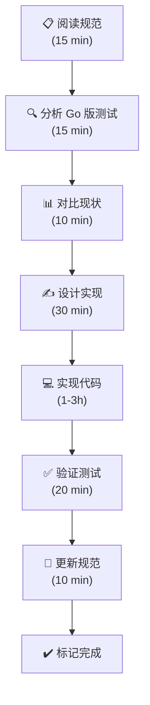

# PocketLess 单测对齐规范

**规范编号**: 034  
**规范名称**: PocketLess (Bun.js 版) 单测对齐计划  
**创建日期**: 2026-03-24  
**当前状态**: 🟡 计划阶段  
**总体进度**: 0% (0/127 关键测试已对齐)

---

## 📖 规范概述

本规范定义了 **PocketLess (Bun.js 版 PocketBase)** 与 **PocketBase (Go 版)** 的单元测试对齐工作计划。

### 核心目标

通过系统地分析 Go 版本的所有单测，逐一在 Bun 版本中补充或完善对应的测试，确保两个版本在：
- ✅ **API 协议** 完全一致
- ✅ **业务逻辑** 完全一致
- ✅ **错误处理** 完全一致
- ✅ **边界情况** 完全一致

### 为什么需要这个规范

目前的现状：
```
PocketBase (Go)    │  PocketLess (Bun)
─────────────────────┼─────────────────────
434 个源文件         │  135 个源文件 (31%)
331 个测试文件       │  128 个测试文件 (39%)
─────────────────────┼─────────────────────
完整的测试套件       │  ❌ 缺失 ~200 个测试
```

这导致了：
1. **不知道 Bun 版本何时与 Go 版本不一致**
2. **无法自信地说两个版本的 API 是等价的**
3. **维护和升级时容易遗漏功能**

### 预期收益

完成本规范后：
- ✅ 两个版本的 API 行为 100% 可验证一致
- ✅ 任何功能差异都会被测试发现
- ✅ 新功能可以被同时实现在两个版本
- ✅ 用户可以安全地在两个版本间切换

---

## 📑 规范文档结构

```
/specs/034-pocketless-test-alignment/
├── README.md                    # ← 你在这里
├── plan.md                      # 总体规划（5 个阶段）
├── phase1-analysis.md           # Phase 1 详细分析（认证系统）
├── methodology.md               # 测试对齐方法论
├── progress.md                  # 实时进度跟踪
├── checklists/
│   ├── phase1-checklist.md     # Phase 1 检查清单
│   └── ...
└── contracts/
    ├── api-contract.md         # HTTP 协议契约
    └── data-model-contract.md  # 数据模型契约
```

### 快速导航

| 文档 | 用途 | 阅读时间 |
|------|------|---------|
| **plan.md** | 了解总体规划和 5 个阶段 | 15 min |
| **phase1-analysis.md** | 深入理解第一阶段的详细任务 | 20 min |
| **methodology.md** | 学习如何执行测试对齐工作 | 20 min |
| **progress.md** | 查看当前进度和待启动任务 | 10 min |

---

## 🎯 快速开始

### 1. 理解整体规划

```bash
# 浏览总体规划
cat specs/034-pocketless-test-alignment/plan.md
```

**关键内容**:
- 5 个阶段的划分（认证 → CRUD → 数据库 → 高级功能 → 工具库）
- 每个阶段的关键测试场景
- 工作量估算 (69-107 小时)

### 2. 启动 Phase 1 (认证系统)

```bash
# 阅读 Phase 1 详细分析
cat specs/034-pocketless-test-alignment/phase1-analysis.md

# 查看 Phase 1 检查清单
cat specs/034-pocketless-test-alignment/checklists/phase1-checklist.md
```

### 3. 学习对齐方法论

```bash
# 掌握 5 步对齐法
cat specs/034-pocketless-test-alignment/methodology.md
```

**5 步法**:
1. 分析 Go 版本测试文件
2. 对比 PocketLess 现状
3. 设计 Bun 测试实现
4. 实现与验证
5. 文档与规范更新

### 4. 开始实现

```bash
# 进入 pocketless 目录
cd pocketless

# 运行现有测试作为基线
bun test

# 开始实现 Phase 1 的第一个任务
# 详见 phase1-analysis.md
```

---

## 📊 工作量估算

### 按优先级

| 优先级 | 阶段 | 工作量 | 状态 |
|--------|------|--------|------|
| **P1** | Phase 1-3 | 28-47h | 📝 规划中 |
| **P2** | Phase 4-5 | 40-60h | ⏳ 待启动 |

### 按阶段

| Phase | 内容 | 工作量 | 新增测试 |
|-------|------|--------|---------|
| 1 | 认证系统 (APIs) | 7-13h | 13 |
| 2 | CRUD 系统 (APIs) | 8-12h | 14 |
| 3 | 数据库系统 (Core) | 14-22h | 38 |
| 4 | 高级功能 (Core) | 8-12h | 12 |
| 5 | 工具库 (Tools) | 32-48h | 50 |

### 时间表（预计）

```
Week 1: Phase 1 (认证)           ~ 10-13h ✓ 关键
Week 2: Phase 2 (CRUD)           ~ 8-12h  ✓ 关键
Week 3-4: Phase 3 (数据库)       ~ 14-22h ✓ 关键
Week 5+: Phase 4-5 (高级/工具)   ~ 40-60h ⏳ 可选
─────────────────────────────────────────────
Total:                             ~ 69-107h
```

---

## 🔄 执行流程

### 每周工作流



### 每个任务的检查清单

```markdown
- [ ] 读理 Go 版本对应的测试文件
- [ ] 提取关键测试场景列表
- [ ] 检查 Bun 版本现有测试
- [ ] 设计缺失测试的实现方案
- [ ] 编写测试代码
- [ ] 运行 `bun test` 验证
- [ ] 对比 Go/Bun 输出
- [ ] 处理发现的差异
- [ ] 在规范中标记已完成
- [ ] 生成对齐验证报告
```

---

## 💡 关键决策

### 对齐优先级

```
P1 (必须对齐):
├─ APIs 层（外部协议）
│  ├─ HTTP 状态码
│  ├─ 响应体格式
│  └─ 错误消息
└─ Core 层（业务逻辑）
   ├─ 字段验证
   ├─ 权限检查
   └─ 数据处理

P2 (应该对齐):
└─ Tools 层（工具函数）
   ├─ 安全模块
   ├─ 类型模块
   └─ 其他工具
```

### 测试框架选择

- **Go 版本**: 标准 Go testing + testify
- **Bun 版本**: Bun 内置测试 API (describe/test/expect)

**对齐方式**: 两个版本都使用各自的标准框架，但测试场景和断言必须一致

### 对齐验证方式

```typescript
// ✅ 推荐方式：一对一对比
Go 版本测试:   Test_POST_AuthWithPassword_Success() 
Bun 版本测试:  test("POST /auth-with-password success", ...)

// 验证:
- HTTP 状态码相同
- 响应格式相同
- JWT Claims 相同
- 错误消息相同
```

---

## 📋 常见问题

### Q1: 为什么需要这么多测试？

**A**: 两个版本用不同的语言实现，容易产生协议偏差。测试是唯一的验证手段。

### Q2: 这会花很长时间吗？

**A**: 是的（69-107 小时）。但这是一次性投资，之后能确保长期的一致性。

### Q3: 能否分阶段进行？

**A**: 可以。优先实现 Phase 1-3 (P1 优先级)，这覆盖了 80% 的关键功能。

### Q4: 如果发现差异怎么办？

**A**: 
1. 记录差异
2. 判断是 Bug 还是设计差异
3. 修复 Bug 或更新规范
4. 在 progress.md 中记录

### Q5: 新功能如何处理？

**A**: 新功能应该：
1. 同时在两个版本中实现
2. 同时添加单测
3. 更新本规范

---

## 🚀 立即行动

### 第一步（今天）

```bash
# 1. 克隆或更新 pocketbase 仓库
cd /Users/yufei/workspace/pocketbase-main

# 2. 阅读规范文档
cat specs/034-pocketless-test-alignment/plan.md

# 3. 了解现状
cd pocketless && bun test

# 4. 检查 Phase 1 任务
cat ../specs/034-pocketless-test-alignment/phase1-analysis.md
```

### 第二步（本周）

```bash
# 1. 启动 Phase 1, Task 1.1 (Record Auth Methods)
# - 分析 Go 版本 apis/record_auth_methods_test.go
# - 设计 Bun 版本实现
# - 创建测试文件

# 2. 运行测试
bun test src/apis/record_auth_methods.test.ts

# 3. 对比 Go 版本结果
cd ..
go test -v ./apis -run TestRecordAuthMethods
```

### 第三步（本月）

- [ ] 完成 Phase 1（所有认证测试）
- [ ] 启动 Phase 2（CRUD 测试）
- [ ] 更新 progress.md

---

## 📞 联系与反馈

### 发现问题或有建议？

1. **在规范中记录**: 更新 `specs/034-pocketless-test-alignment/progress.md`
2. **创建 Issue**: 如果是 Bug 或重大差异
3. **更新规范**: 如果是设计决策

### 规范维护

- **主要维护者**: AI Assistant
- **审查者**: 项目团队
- **更新频率**: 每周（每个 Phase 完成后）

---

## 📚 附件

### 相关文档

- `plan.md` - 总体规划（详细）
- `phase1-analysis.md` - Phase 1 分析（非常详细）
- `methodology.md` - 对齐方法论
- `progress.md` - 实时进度跟踪

### 参考资源

- **Go 版本测试**: `/apis/*_test.go`, `/core/*_test.go`
- **Bun 版本测试**: `/pocketless/src/**/*.test.ts`
- **PocketLess 规范**: `specs/032-pocketless/spec.md`

---

## 版本历史

| 版本 | 日期 | 更新内容 |
|------|------|---------|
| 1.0 | 2026-03-24 | 初始规范发布 |

---

**最后更新**: 2026-03-24  
**下一个审查**: 待 Phase 1 启动后  
**总体状态**: 🟡 规划完成，待实施

---

**开始对齐之旅** 👉 阅读 [`plan.md`](./plan.md)
