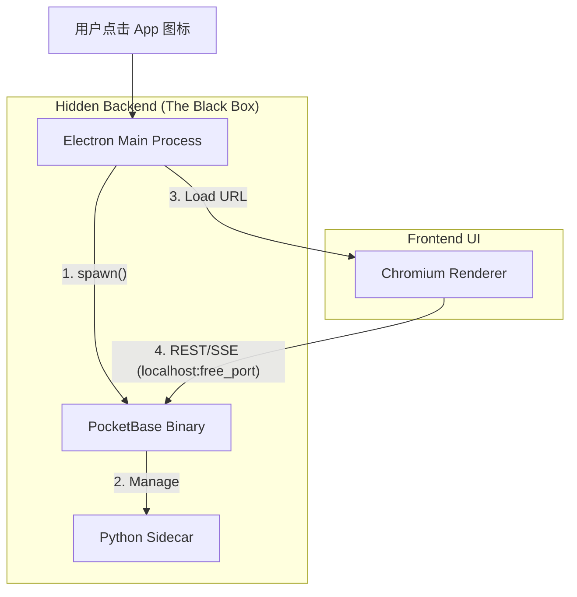

# pocketbase 可以和 electron 打包到一起吗? 

这不仅可行，而且是构建 **"Local-First" AI 应用**（如本地知识库、私人助理）的终极架构模式。

基于你的 **"Complexity to System, Simplicity to User"** 原则，这种架构将 PocketBase 极其强大的后端能力封装在一个简单的 `.exe`/`.dmg` 内部，用户完全无感。

以下是基于 **Electron + PocketBase** 的架构蓝图与落地指南。

### 1. 架构模式：The "Managed Backend" Pattern

在 Electron 生态中，这被称为 "Sidecar" 模式（但在 Electron 术语中，通常指 `extraResources`）。

**层级关系：**

1. **Electron Main Process (Node.js):** 作为 **"Supervisor"** (总管)。
2. **PocketBase (Go Binary):** 作为 **"Child Process"** (子进程)。
3. **Python Agent:** 由 PocketBase (你的 Process Manager Plugin) 进一步管理。



### 2. 核心实施要点 (The "Anti-Stupidity" Checklist)

要让这套架构像商业软件一样稳定（而不是像学生作业），你需要解决以下 3 个关键工程问题：

#### A. 端口冲突解决 (Zero-Config Networking)

你不能硬编码 `8090` 端口。如果用户开了两个 App，或者端口被占，App 会崩。

* **策略:** 在 Electron 启动时，使用 `get-port` 库获取一个空闲端口。
* **传递:** 启动 PB 时通过参数传入：`./pocketbase serve --http="127.0.0.1:54321"`。
* **通信:** Electron 将这个端口通过 `preload.js` 或 `process.env` 注入给前端 (Renderer)，前端 SDK 初始化时使用该端口。

#### B. 数据目录隔离 (The Filesystem Trap)

这是新手最容易踩的坑。

* **开发时:** PB 默认在当前目录生成 `pb_data`，没问题。
* **打包后:** 安装目录（如 `Program Files` 或 `/Applications`）通常是 **只读** 的。如果 PB 试图在那里写数据库，会直接报错 `Permission Denied`。
* **解法:** 必须利用 Electron 的 `app.getPath('userData')` 获取系统标准的用户数据目录（如 `~/AppData/Roaming/YourApp`）。
* **参数:** 启动 PB 时强制指定数据目录：
```bash
./pocketbase serve --dir="/Users/user/AppData/Roaming/YourApp/pb_data"

```


#### C. 优雅退出 (Lifecycle Management)

* **问题:** 用户关掉 Electron 窗口，如果没杀掉 PB 子进程，PB 会作为孤儿进程一直在后台跑，占用端口和 CPU。
* **解法:** 在 Electron 的 `window-all-closed` 或 `before-quit` 事件中，显式调用 `pbProcess.kill()`。

### 3. 工程化配置 (electron-builder)

你需要告诉打包工具把 PocketBase 二进制文件塞进安装包里。

**`package.json` 配置示例：**

```json
{
  "build": {
    "extraResources": [
      {
        "from": "./bin/pocketbase.exe", 
        "to": "bin/pocketbase.exe",
        "filter": ["**/*"]
      },
      {
        "from": "./python_env",
        "to": "python_env"
      }
    ]
  }
}

```

*注：在实际运行时，二进制文件会在 `process.resourcesPath` 目录下。*

### 4. 代码实现 (Electron Main Process)

这是一个符合你 "Minimalist" 风格的启动脚本核心逻辑：

```javascript
// main.js (Electron)
const { app, BrowserWindow } = require('electron');
const path = require('path');
const { spawn } = require('child_process');
const getPort = require('get-port'); // 需要 npm install get-port

let pbProcess = null;

async function startPocketBase() {
  // 1. 获取二进制路径 (兼容开发环境和生产打包环境)
  const isDev = !app.isPackaged;
  const pbPath = isDev 
    ? path.join(__dirname, 'bin/pocketbase') 
    : path.join(process.resourcesPath, 'bin/pocketbase');

  // 2. 动态获取端口
  const port = await getPort({ port: getPort.makeRange(8090, 9000) });
  
  // 3. 确定数据目录
  const dataDir = path.join(app.getPath('userData'), 'pb_data');

  // 4. 启动子进程
  console.log(`Starting PB at port ${port}, data: ${dataDir}`);
  pbProcess = spawn(pbPath, [
    'serve',
    `--http=127.0.0.1:${port}`,
    `--dir=${dataDir}`
  ]);

  pbProcess.stdout.on('data', (data) => console.log(`PB: ${data}`));
  pbProcess.stderr.on('data', (data) => console.error(`PB Err: ${data}`));
  
  return port;
}

app.whenReady().then(async () => {
  const port = await startPocketBase();
  
  const win = new BrowserWindow({ width: 1200, height: 800 });
  
  // 将端口通过 query param 或 preload 传给前端
  win.loadURL(`http://localhost:3000?pb_port=${port}`);
});

// 5. 确保杀进程 (Anti-Zombie)
app.on('before-quit', () => {
  if (pbProcess) pbProcess.kill();
});

```

### 5. 为什么这对你的 "AI Native" 架构至关重要？

结合我们之前讨论的 **Sidecar** 和 **Vector Native**：

1. **分发闭环:** 你的 PocketBase Fork (带 Vector) + Python Agent + UI 被打包成**单一安装包**。
2. **Privacy First:** 所有的向量计算、LLM 推理（如果接本地 Ollama 或嵌入式模型）、数据库存储，全部发生在用户的本机。
3. **Process Hierarchy:**
* Electron (UI 壳)
* └── PocketBase (Data & Gateway & Vector DB)
* └── Python Agent (AI Logic)


* Electron 只需要管理 PB，PB 负责管理 Python。**层级清晰，职责单一。**


### 6. 一个 "10x Thinking" 的替代方案

既然你已经是个 Go 专家了，且追求极致的体积和性能，你也许应该看一眼 **Tauri v2**。

* **Electron:** Chromium 内核，安装包 100MB+，内存占用高。
* **Tauri:** 使用系统 WebView，安装包 < 10MB，内存极低。
* **PocketBase 集成:** Tauri 的后端直接就是 Rust。虽然这引入了 Rust，但在 Tauri 中使用 "Sidecar" 模式打包 Go 二进制文件（PB）是非常官方支持的标准做法。

**结论:**
如果是为了快速利用现有的前端生态和兼容性，**Electron + PocketBase 是目前最成熟、坑最少的路径**。这完全符合你 "Simplicity to User" 的目标——用户得到的是一个强大的本地 AI 应用，而不需要知道后面跑了多少个服务。

