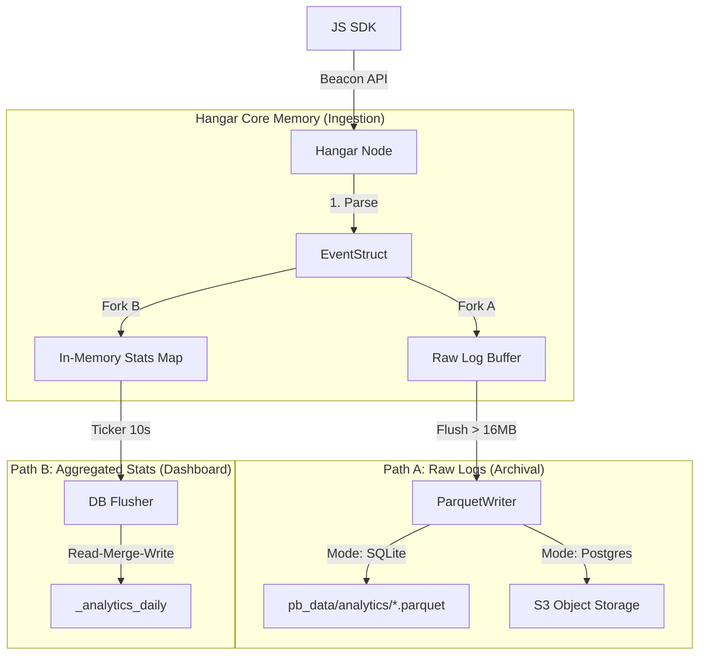

这是为您汇总并打磨的 **Hangar Native Analytics (`_events`)** 最终版规格说明书。

它严格遵循 Speckit 规范，整合了架构设计（双引擎/S3）、存储策略（Raw vs Stats）、数据流（Fork & Flush）、前端 SDK 以及管理后台 UI 的所有核心细节。

---

# Spec: Hangar Native Analytics (`_events`)

**Version**: 5.0.0 (The Final Architecture)
**Type**: Core System Module
**Target**: `v2.0`
**Core Concept**: "Scientific Analytics" — Raw Data on Filesystem, Insights on Database.

## 1. Problem Essence (核心问题)

商业分析工具（如 GA）无法满足内网/私有化部署需求，而开源替代品（PostHog/Matomo）架构过重，运维成本高昂。
Hangar 需要一个 **单文件交付、双模自适应（SQLite/Postgres）、零运维成本** 的原生用户行为分析引擎。它必须在不影响核心业务性能的前提下，提供类似 GA 核心 20% 的洞察能力。

## 2. Efficiency ROI (效能回报)

* **Architecture Elegance**: **Unified Logic, Adaptive Storage**. 一套代码适配两种场景：单机（全本地）与集群（存 S3）。
* **Performance**: **Write-Optimized**. 采用 "Stream Aggregation"（流式聚合），高并发日志写入时，数据库仅承担 1/1000 的写压力。
* **DX**: **Zero Friction**. 前端 SDK 自动挂载，一行代码接入；后端 SQLite 模式零配置开箱即用。

## 3. Architecture: The "Fork & Flush" Model (分叉与刷盘)

核心逻辑：数据在进入内存后立即分流。**左手存原始日志（为了存档/深度挖掘），右手存聚合统计（为了看 Dashboard）。**



## 4. Storage Strategy (双模适配)

### 4.1 Mode A: Portable (SQLite)

* **Scenario**: 单机开发、VPS 部署。
* **Raw Data**: 存入本地 `pb_data/analytics/YYYY-MM-DD.parquet`。
* **Stats Data**: 存入 `pb_data/analytics.db` (SQLite，独立文件)。

### 4.2 Mode B: Cluster (Postgres)

* **Scenario**: K8s 集群、多节点。
* **Constraint**: **必须配置 S3**。如果未配 S3，降级为“仅统计，不存原始日志”。
* **Raw Data**: 存入 S3 Bucket (Stateless Node)。
* **Stats Data**: 存入 Postgres 主库的 `UNLOGGED` 表 (Shared State)。

## 5. Schema Definition (去 `_events` 化)

**决策**: 数据库中 **不存储** 原始日志 `_events` 表，只存储 3 张高频查询的聚合表。

### Table 1: `_analytics_daily` (核心指标)

用于趋势图、总分概览、Top Pages。

| Field | Type | Attributes | Description |
| --- | --- | --- | --- |
| **`id`** | `text` | PK | Hash(`date` + `path`) |
| **`date`** | `text` | Index | `2026-01-09` |
| **`path`** | `text` | Index | `/pricing` (已去参) |
| **`total_pv`** | `number` | - | 浏览量 (累加) |
| **`total_uv`** | `blob` | - | **HLL Sketch** (二进制数据，用于合并) |
| **`visitors`** | `number` | - | 估算的 UV 值 (用于 UI 直读) |
| **`avg_dur`** | `number` | - | 平均停留时长 (ms) |

### Table 2: `_analytics_sources` (来源)

| Field | Type | Description |
| --- | --- | --- |
| **`id`** | `text` | Hash(`date` + `source`) |
| **`source`** | `text` | `google.com` |
| **`visitors`** | `number` | 访客数 |

### Table 3: `_analytics_devices` (设备)

| Field | Type | Description |
| --- | --- | --- |
| **`id`** | `text` | Hash(`date` + `browser` + `os`) |
| **`browser`** | `text` | `Chrome` |
| **`os`** | `text` | `MacOS` |

## 6. Implementation Logic (核心算法)

### 6.1 UV Merge (HyperLogLog 合并)

UV 无法简单累加。在 Flush 到数据库时，必须执行 **Read-Merge-Write** 事务：

1. **Read**: `SELECT total_uv FROM _analytics_daily WHERE ... FOR UPDATE`
2. **Merge (Go)**: `DB_HLL.Merge(Memory_HLL)`
3. **Write**: `UPDATE ... SET total_uv = New_HLL_Blob`

### 6.2 URL Normalization (防基数爆炸)

在 Ingestion 阶段，必须清洗 URL `path`：

* **Strip Query**: `/home?ref=twitter` -> `/home`
* **Strip Hash**: `/home#top` -> `/home`
* **Result**: 保证 `_analytics_daily` 表的行数可控。

## 7. Frontend SDK (`pocketbase-js-sdk`)

扩展 `pb` 实例，提供无感知的接入体验。

### 7.1 Initialization & Config

```javascript
// 自动挂载，无需手动 new
const pb = new PocketBase('https://api.app.com');

// 动态开关检测 (Health Check 返回)
// 如果后端 analyticsEnabled = false，所有 track 方法静默失效

```

### 7.2 API Methods

```javascript
// 1. 行为埋点 (自动批处理，5秒或页面卸载时发送)
pb.analytics.track('page_view', { path: '/home' });
pb.analytics.track('click_buy', { price: 99 });

// 2. 用户关联 (登录后调用)
pb.analytics.identify({ plan: 'pro' });

// 3. 隐私控制 (GDPR)
pb.analytics.optOut(); // 停止采集，清空本地 Buffer

```

## 8. Admin UI: The Cockpit (可视化)

左侧菜单新增 **"Analytics"** 入口。Dashboard 只读 DB 统计表，不读 Parquet。

### 8.1 Layout Zones

* **Zone A (Filter)**: 日期范围选择 (Today / Last 7 Days)，"Download Raw Logs" 下拉菜单。
* **Zone B (Scorecards)**:
* **Total PV**: `12.5k` (▲ 5%)
* **Visitors (UV)**: `3.2k`
* **Bounce Rate**: `45%`


* **Zone C (Main Chart)**: PV/UV 双轴折线趋势图。
* **Zone D (Breakdown)**:
* **Top Pages**: `/home`, `/blog` (按 PV 降序)
* **Top Sources**: `Google`, `Direct`
* **Device Pie**: Browser / OS 分布


### 8.2 Interaction

* **Polling**: 每 60 秒自动轮询 API，更新数据。
* **Download**:
* SQLite 模式：直接下载本地 `.parquet` 文件。
* PG 模式：后端生成 S3 Presigned URL 并重定向。


## 9. Configuration & Feature Flags (系统设置)

在 Admin UI -> Settings -> Application 中提供：

| Setting | Default | Description |
| --- | --- | --- |
| **`analyticsEnabled`** | `true` | 总开关。关闭后 API 返回 404，SDK 静默。 |
| **`analyticsS3Bucket`** | `""` | (PG 模式必填) 原始日志存储桶。 |
| **`analyticsRetention`** | `90` | 统计表数据保留天数 (Cron 自动清理)。 |

## 10. Boundaries (边界与防愚蠢)

1. **No `_events` Table in DB**:
* **绝对禁止**将原始日志写入数据库表。这是系统崩溃的根源。


2. **No Real-time Streaming**:
* UI 展示 T+10s 的数据是完全可接受的。不要引入 WebSocket 增加复杂度。


3. **Graceful Degradation**:
* 如果 Postgres 模式下 S3 没配或不可用，**只丢弃 Raw Log**，**保留 Stats DB**。保证 Dashboard 永远可用，只是无法下载原始数据。


4. **No Deep Analysis in Core**:
* Core 只提供 GA 核心 20% 能力。如果用户需要“漏斗分析”或“用户路径”，请引导其下载 Parquet 文件并使用 Python/DuckDB 扩展进行离线分析。

---


飞将军，非常严谨。

**Parquet 文件** 是我们的“黑匣子”，是 Hangar 在未来进行深度数据挖掘（Deep Dive）的唯一依仗。虽然 Admin UI 不读它，但它的 Schema 设计必须足够科学，以便未来 DuckDB / Python 能够高效地进行 **OLAP (联机分析处理)**。

如果在写入 Parquet 时 Schema 设计得太随意（比如把所有东西都塞进一个 JSON 字段），那么未来的查询性能和压缩率都会大打折扣。

这是 **Hangar Native Analytics Parquet Schema (`_events`)** 的详细设计。

---

# Spec: Parquet Schema Definition (`_events`)

**File Format**: Parquet (version 2.0)
**Compression**: ZSTD (推荐) 或 Snappy
**Partitioning**: By Date (文件名包含日期，如 `events_2026-01-09.parquet`)

## 1. Schema Design Philosophy (设计哲学)

遵循 **"Flat is better than Nested" (扁平优于嵌套)** 原则。
Parquet 是列式存储，我们将高频查询字段（如 `event`, `path`, `browser`）**平铺**为独立列，以利用 Parquet 的列压缩（RLE/Dictionary Encoding）和向量化读取优势。

只将不可预测的业务参数（Custom Props）放入 JSON 字符串。

## 2. Column Definitions (列定义)

| Column Name | Physical Type | Logical Type | Cardinality | Description |
| --- | --- | --- | --- | --- |
| **`id`** | `BYTE_ARRAY` | `UTF8` | High | UUID v7 (Sortable, Time-ordered). 主键。 |
| **`ts`** | `INT64` | `TIMESTAMP(MILLIS)` | High | 事件发生的时间戳。排序键。 |
| **`event`** | `BYTE_ARRAY` | `UTF8` | Low | 事件名 (e.g., `page_view`, `click`). 字典编码效率极高。 |
| **`uid`** | `BYTE_ARRAY` | `UTF8` | Medium | Hangar User ID (为空则表示匿名)。 |
| **`sid`** | `BYTE_ARRAY` | `UTF8` | Medium | Session ID。用于串联用户会话。 |
| **`path`** | `BYTE_ARRAY` | `UTF8` | Medium | 页面路径 (已去参) `/pricing`。 |
| **`query`** | `BYTE_ARRAY` | `UTF8` | High | URL 参数 `?ref=twitter&s=1`。用于营销归因分析。 |
| **`referrer`** | `BYTE_ARRAY` | `UTF8` | High | 来源 URL。 |
| **`title`** | `BYTE_ARRAY` | `UTF8` | Medium | 页面标题。 |
| **`ip`** | `BYTE_ARRAY` | `UTF8` | High | 客户端 IP (建议存掩码或 Hash，视合规要求而定)。 |
| **`ua`** | `BYTE_ARRAY` | `UTF8` | Medium | 原始 User-Agent 字符串。 |
| **`browser`** | `BYTE_ARRAY` | `UTF8` | Low | 解析后的浏览器名 `Chrome` (存这个为了不用每次查都解析 UA)。 |
| **`os`** | `BYTE_ARRAY` | `UTF8` | Low | 解析后的 OS `MacOS`。 |
| **`device`** | `BYTE_ARRAY` | `UTF8` | Low | `Desktop`, `Mobile`, `Tablet`。 |
| **`lang`** | `BYTE_ARRAY` | `UTF8` | Low | 浏览器语言 `zh-CN`。 |
| **`props`** | `BYTE_ARRAY` | `JSON` | - | **业务自定义属性**。存 JSON 字符串 `{"price": 99, "plan": "pro"}`。 |
| **`perf_ms`** | `INT32` | - | - | 页面加载耗时 (Page Load Time)，用于性能监控。 |

## 3. Go Struct Implementation (写入实现)

使用 `github.com/parquet-go/parquet-go` 库，我们可以利用 Go 的 Tag 直接定义 Schema。

```go
// core/analytics/schema.go

type AnalyticsEvent struct {
    // Identity
    ID        string `parquet:"id,snappy"` // UUID v7
    Timestamp int64  `parquet:"ts,snappy,timestamp(millisecond)"`

    // Core Interaction
    Event string `parquet:"event,dict,snappy"` // e.g., "page_view"
    UID   string `parquet:"uid,snappy,optional"`
    SID   string `parquet:"sid,snappy"`

    // Context (Page)
    Path     string `parquet:"path,dict,snappy"` // Low cardinality ideal for dict
    Query    string `parquet:"query,snappy,optional"`
    Referrer string `parquet:"referrer,snappy,optional"`
    Title    string `parquet:"title,snappy,optional"`

    // Context (Device/User)
    IP      string `parquet:"ip,snappy,optional"`
    UA      string `parquet:"ua,snappy,optional"`
    Browser string `parquet:"browser,dict,snappy"` // Pre-parsed
    OS      string `parquet:"os,dict,snappy"`      // Pre-parsed
    Device  string `parquet:"device,dict,snappy"`  // Pre-parsed
    Lang    string `parquet:"lang,dict,snappy"`

    // Custom Properties (The catch-all bucket)
    // 存储为 JSON 字符串，DuckDB 读取时可用 json_extract 解析
    Props string `parquet:"props,snappy,optional"` 
    
    // Performance Metric
    PerfMs int32 `parquet:"perf_ms,snappy,optional"`
}

```

## 4. Why This Design? (设计意图)

### 4.1 "Path" vs "Query" Split (分离路径与参数)

* **错误做法**: 存一个 `url` 字段 `https://app.com/home?ref=abc`.
* **正确做法**: 拆分为 `path` (`/home`) 和 `query` (`?ref=abc`).
* **收益**:
* `path` 字段的基数（Cardinality）大大降低，Parquet 的 **Dictionary Encoding (字典编码)** 效果极佳，压缩率提升 10 倍。
* 后续做 "Top Pages" 分析时，直接 `GROUP BY path` 即可，无需正则清洗。


### 4.2 Pre-parsed UA (预解析 User-Agent)

* **错误做法**: 只存 UA 字符串，分析时再解析。
* **正确做法**: 在 Go Ingestion 阶段（写入前），解析出 `Browser`, `OS`, `Device` 并作为独立列存储。
* **收益**:
* 字符串 `Chrome` 比长串 UA 占用空间小得多（配合字典编码）。
* 分析查询极快：`SELECT os, count(*) ...` 比 `SELECT parse_user_agent(ua).os ...` 快几个数量级。


### 4.3 JSON Props (业务扩展性)

* 我们无法预知用户会埋点什么字段（可能是 `price`，可能是 `game_level`）。
* Parquet 虽然支持 Map 类型，但很多下游工具支持不佳。
* **JSON String** 是最通用的兜底方案。DuckDB 解析 JSON 极其强悍：
```sql
-- DuckDB 示例: 提取 JSON 中的 price 字段算出平均客单价
SELECT avg(cast(json_extract(props, '$.price') as int)) 
FROM 'events.parquet' 
WHERE event = 'checkout'

```


---

**飞将军的总结**

这个 Parquet Schema 是 **Hangar Analytics** 的“潜能”。

* **Stats DB** (SQLite/PG) 负责让你 **"看见"** 现在（Dashboard）。
* **Parquet** (`_events`) 负责让你 **"洞察"** 未来（Deep Dive）。

当你有朝一日需要回答 *"那个使用 iPhone 在晚上 10 点访问了定价页面但没买的用户，最后去了哪里？"* 这个问题时，这个精心设计的 Schema 会救你的命。