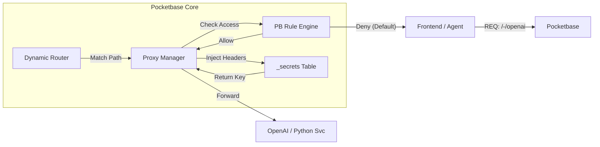

# Spec: Pocketbase Native Gateway (`_proxies`)

**Version**: 2.0.0 (Final)
**Type**: Core System Feature
**Target**: `v2.0` (Day 1 Feature)
**Status**: Ready for Dev

## 1. Problem Essence (核心问题)

现代 AI 应用开发面临“鉴权割裂”与“密钥泄露”的双重风险：前端直接调用 LLM 会泄露 API Key，而使用 Nginx/BFF 层又导致鉴权逻辑与 PocketBase 的用户体系脱节。此外，开发环境（Vite）与生产环境（Go）的端口分离导致了糟糕的 DX（开发体验）。

## 2. Efficiency ROI (效能回报)

* **安全性 (Security)**: **默认拒绝 (Secure by Default)**。密钥永远不出服务端内存。
* **开发流 (Flow)**: **0 上下文切换**。无需修改 Nginx 配置，在 Admin UI 中动态配置路由；无需处理 CORS，前后端同源。
* **极简主义 (Simplicity)**: 引入 **`/-/`** 命名空间，实现“零思维成本”的微服务/API 挂载。

## 3. Spec/Design (系统设计)

### 3.1 Architecture (架构逻辑)



### 3.2 Schema Definition: `_proxies` Collection

创建一个系统级 Collection，数据存储于核心数据库。

| Field | Type | Options | Description |
| --- | --- | --- | --- |
| **`id`** | `text` | System | 唯一标识 |
| **`path`** | `text` | `Unique`, `Required` | 拦截路径 (支持绝对路径) |
| **`upstream`** | `url` | `Required` | 目标服务地址 |
| **`strip_path`** | `bool` | Default `true` | 转发时是否移除匹配的前缀 |
| **`access_rule`** | `text` | **View Rule** | **核心鉴权逻辑**。 |
| **`headers`** | `json` | Template Support | 注入的请求头配置 |
| **`timeout`** | `number` | Default `30` | 超时时间 (秒) |
| **`active`** | `bool` | Default `true` | 软开关 |

### 3.3 Routing Logic: The `/-/` Convention (路由逻辑)

为了保持系统的整洁与防冲突，采用以下路由策略：

1. **Recommended Convention (推荐)**: 使用 **`/-/`** 作为网关专用前缀。
* *Ex*: `/-/gpt4`, `/-/stripe`, `/-/pdf-parser`
* *Why*: 与 `/_/` (Admin) 和 `/api/` (Data) 形成完美的对称美学。


2. **Absolute Freedom (自由路径)**: 允许用户定义任意绝对路径。
* *Ex*: `/v1/chat/completions` (伪装成 OpenAI 原生接口)


3. **System Guard (防愚蠢保护)**:
* 🚫 **禁止**以 `/api/` 开头（保护核心数据 API）。
* 🚫 **禁止**以 `/_/` 开头（保护 Admin UI）。
* 尝试保存此类 `path` 时，API 将返回 `400 Validation Error`。


### 3.4 Access Control: Secure by Default (权限逻辑)

与 PocketBase Collection 的 API Rules 行为保持严格一致：

* **Rule is Empty ("") or Null**: **仅 Admin (Superuser) 可访问**。
* *默认状态*: 新创建的代理默认不对外开放，防止意外暴露内网服务。


* **Rule is "true"**: **公开访问 (Public)**。
* *场景*: Webhook 回调、公开的只读接口。


* **Rule is Expression**: **按规则鉴权**。
* *Ex*: `@request.auth.id != ""` (仅登录用户)
* *Ex*: `@request.auth.subscription = 'pro'` (仅 VIP)


### 3.5 Header Injection (密钥注入)

支持动态解析 `headers` JSON，实现机密数据的“即时注入”。

* **Syntax**:
* `{env.VAR_NAME}`: 读取宿主机环境变量。
* `{secret.VAR_NAME}`: 读取 `_secrets` 系统表（密文存储）。


* **Example**:
```json
{
  "Authorization": "Bearer {secret.OPENAI_KEY}",
  "X-User-Id": "@request.auth.id"  // 支持注入当前上下文的用户ID
}

```


### 3.6 Dev Proxy (本地开发特化)

针对 Vite 等前端工具，提供无数据库依赖的透明代理。

* **Flag**: `./Pocketbase serve --dev-proxy="http://localhost:5173"`
* **Behavior**:
* Pocketbase 启动一个 **Catch-All (Fallback)** 路由。
* 凡是未被 `/api/`, `/_/`, `/-/` 命中的请求，全部透传给 Vite。
* **效果**: 开发者只需访问 `localhost:8090`，即可同时享受后端 API 和前端 HMR (热更新)。


## 4. Usage Examples (使用示例)

### Scenario A: Secure AI Gateway

Admin UI 配置：

```json
{
  "path": "/-/openai",
  "upstream": "https://api.openai.com/v1",
  "strip_path": true,
  "access_rule": "@request.auth.id != ''", // 仅登录用户
  "headers": {
    "Authorization": "Bearer {secret.OPENAI_SK}"
  }
}

```

前端调用：

```javascript
// 极简调用，零鉴权心智负担
const res = await fetch('/-/openai/chat/completions', { ... });

```

### Scenario B: Public Webhook Handler

Admin UI 配置：

```json
{
  "path": "/-/hooks/stripe",
  "upstream": "http://internal-worker:3000/stripe",
  "access_rule": "true", // 公开，需在上游服务校验 Stripe 签名
}

```

## 5. Boundaries (系统边界)

* ❌ **No Response Modification**: 网关仅做透传（Streaming 支持）。如需修改响应内容（如数据清洗），请使用 Serverless Function (`pb_serverless`)。
* ❌ **No Complex Balancing**: 不支持加权轮询、熔断器配置。
* ❌ **No Static Hosting**: 不要用此功能代理 S3 静态资源（会增加 GC 压力）。

## 6. Implementation Plan (实施计划)

1. **Migration**: 创建 `system_migration`，初始化 `_proxies` 表。
2. **Core**: 在 `core/app.go` 实现 `DynamicRouter`，监听 `_proxies` 的变更事件以触发 Hot Reload。
3. **Middleware**: 实现 `ProxyAuthMiddleware`，复用 PB 的 `daos.CanAccess` 逻辑。
4. **CLI**: 添加 `--dev-proxy` 启动参数支持。
