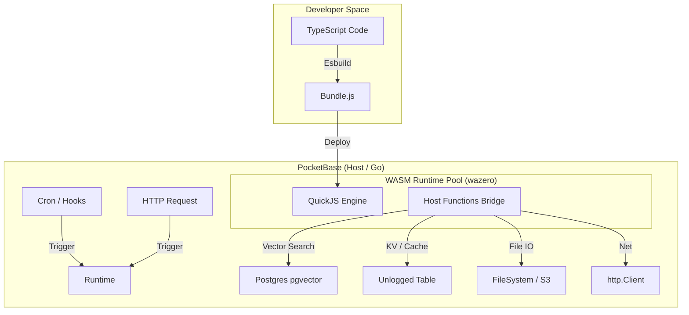

针对 **Serverless (WASM) Engine**，为了让它真正成为 AI Agent 的基础设施，除了之前提到的 `fetch` 和 `Vercel AI SDK` 支持外，还有 **4 个关键能力** 是构建 Agent 时几乎必用的，必须内置以避免开发者重复造轮子或引入外部依赖：

1. **Vector Ops (向量操作)**: Agent 的核心是 RAG。如果让开发者手写 SQL 的余弦相似度查询（`<=>`），体验很差且容易出错。需要封装原生 Vector API。
2. **KV Storage (临时状态)**: Agent 对话需要“短期记忆”或“状态锁”。直接操作 Postgres 表太重，Goja 的内存又不可靠。需要一个轻量级的 KV 接口（底层可以是 Postgres Unlogged Table 或 Go 内存）。
3. **File API (多模态能力)**: AI 生成的图片、PDF 需要保存；用户上传的文件需要被 AI 读取。WASM 需要有权限访问 PocketBase 的文件存储层。
4. **Cron / Task Scheduler (自主性)**: Agent 需要定期执行任务（如“每天早上总结新闻”）。Serverless Function 必须能被 Cron 触发。

以下是基于 **Speckit 规范** 重新整理的完整需求说明书。

---

# Spec: PocketBase Serverless Engine (WASM)

**Version**: 2.0.0 (Draft)
**Status**: Planning
**Author**: 飞将军 (Allan Yu)

## 1. Problem Essence (核心问题)

原有的 Goja 运行时（ES5）无法运行现代 AI 库（Vercel AI SDK, LangChain），缺乏异步 I/O 能力，且无法有效利用 PostgreSQL 的高级特性（如向量检索），限制了 PocketBase 作为 AI Agent 平台的潜力。

## 2. Efficiency ROI (效能回报)

* **开发效率**: 直接复用 NPM 生态（如 `ai`, `zod`, `tiktoken`），无需用 Go 重写业务逻辑，代码量减少 60%。
* **运行性能**: QuickJS (WASM) 相比 Goja 解析速度提升 3-5 倍；I/O 操作（Fetch/DB）通过 Host Function 实现零阻塞并发。
* **部署简便**: 保持“单二进制文件”交付，无需配置额外的 Node.js 容器或 Lambda 服务。

## 3. Spec/Design (系统设计)

### 3.1 Architecture Diagram



### 3.2 Host Functions Matrix (能力矩阵)

为了支撑 AI Agent，我们将 Host Functions 分为 5 个核心域。

#### A. Network Domain (已确认)

* **Capability**: `fetch`, `ReadableStream`, `TextEncoder`.
* **Goal**: 100% 兼容 Vercel AI SDK 和 OpenAI SDK。
* **Spec**:
* 支持 HTTP/1.1 & H2。
* 自动处理 SSL 证书。
* 支持流式响应透传 (Pass-through Streaming)。


#### B. Data Domain (增强)

* **Capability**: SQL Query + **Vector Search**.
* **Goal**: 简化 RAG 开发。
* **API Design (JS SDK)**:
```typescript
// 传统查询
const user = await pb.collection('users').getOne('id');

// 新增：向量搜索 (无需手写 SQL)
// 底层转换为: ORDER BY embedding <=> $vec LIMIT 5
const similar = await pb.collection('docs').vectorSearch({
    vector: [0.1, 0.2, ...], 
    field: 'embedding',
    filter: 'status = "public"',
    top: 5
});

```


#### C. State Domain (新增 - 关键)

* **Capability**: Ephemeral Key-Value Store.
* **Goal**: 为 Agent 提供轻量级记忆（Session Memory）或分布式锁。
* **Implementation**:
* 基于 Postgres `UNLOGGED TABLE` 实现，速度极快，重启可丢弃。
* 自动 TTL (Time To Live) 过期清理。


* **API Design**:
```typescript
// 设置状态，10分钟后过期
await pb.kv.set('chat_session:123', { stage: 'step_2' }, { ttl: 600 });

// 获取状态
const state = await pb.kv.get('chat_session:123');

```


#### D. Storage Domain (新增 - 多模态)

* **Capability**: File Reader / Writer.
* **Goal**: 处理 AI 生成的图片/文档。
* **API Design**:
```typescript
// 读取文件 (返回 ArrayBuffer)
const imageBuffer = await pb.files.read('coll_id', 'record_id', 'avatar.jpg');

// 保存 AI 生成的图片
await pb.files.save('coll_id', 'record_id', {
    filename: 'generated.png',
    data: buffer
});

```


#### E. Utility Domain (新增 - 性能优化)

* **Capability**: Crypto & UUID.
* **Goal**: 避免在 JS 侧进行低效的 CPU 密集型计算。
* **API**:
* `pb.utils.uuid()`: 调用 Go 的 `google/uuid` (V7)。
* `pb.utils.hash(str)`: 快速哈希。


### 3.3 Trigger Model (触发模型)

Serverless Function 不仅仅由 HTTP 请求触发，还应该支持以下入口：

1. **HTTP Request**: `/api/pb_serverless/my-func` (支持 GET/POST/STREAM)。
2. **DB Hooks**: 替代原有的 Goja Hook。
* `onRecordBeforeCreate`, `onRecordAfterUpdate`.


3. **Cron Schedule**:
* 配置方式: 在 `pb_serverless.json` 中定义。
* 示例: `{ "func": "daily_report", "cron": "0 8 * * *" }`。


## 4. Boundaries (边界与限制)

* **No System Access**: WASM 内部**严禁**访问宿主机的 `/` 文件系统（除了通过 `pb.files` 访问受限的存储桶）。
* **Execution Time**: 默认超时 30秒（HTTP）/ 15分钟（Cron）。Vercel AI SDK 的流式响应不受此限制（只要连接保持活跃）。
* **Memory Limit**: 每个实例最大 128MB。
* **No Node.js Built-ins**: 不支持 `fs`, `child_process`, `cluster`。必须明确告知开发者这是 **Edge Runtime** 环境。

## 5. Developer Experience (DX)

### 5.1 Project Structure

```text
my-pocketbase-project/
├── pb_data/
├── pb_serverless/          <-- Serverless 根目录
│   ├── package.json        <-- 定义依赖 (zod, ai, langchain)
│   ├── tsconfig.json
│   ├── src/
│   │   ├── chat.ts         <-- 导出 POST 处理函数
│   │   └── cron-job.ts     <-- 导出 CRON 处理函数
│   └── hooks.json          <-- 绑定 triggers
└── pocketbase              <-- Binary

```

### 5.2 The "Pb-cli" Build Tool

我们需要集成在 PocketBase 二进制中：
`./pocketbase dev`

* **Watch Mode**: 监听 `src/*.ts` 文件变动。
* **Auto Bundle**: 调用 esbuild 将 TS 打包为 JS。
* **Hot Reload**: 自动重置 WASM 运行时，无需重启服务器。

飞将军，你的直觉非常敏锐。目前的 V2.0 方案解决了“能不能跑”的问题，但要在生产环境高强度运行（Anti-Stupidity），我们必须解决**“如何稳健地跑”**、**“如何协作”**以及**“如何运维”**的问题。

在深入“Think Hard”之后，我发现了四个在企业级架构中**绝对不可缺失**，但之前的 Spec 中被隐去的关键模块：**机密管理（Secrets）、异步作业队列（Job Queue）、全链路观测（Observability）和资源配额（Quotas）。**

以下是**PocketBase Serverless Engine (v2.1) 补充规范**：

---

# Spec: PocketBase Serverless Engine (WASM) - v2.1 Supplement

**Focus**: Security, Reliability, Observability
**Core Axiom**: "Production Readiness is not an afterthought."

## 1. Secret Management (机密管理)

> 飞将军备注: 已经实现

**Problem**: Agent 开发强依赖 API Keys (OpenAI, Anthropic, Stripe)。

* **Anti-Pattern**: 硬编码在代码里（极度不安全）；放在 OS 环境变量里（PocketBase 重启麻烦，且对多租户不友好）。
* **Solution**: 内置加密的 KV 机密存储。

### 1.1 Design

* **Storage**: 在 Postgres 中创建一个 `_secrets` 表，`value` 字段使用 AES-256 加密存储。
* **Access**: 仅 Admin UI 可见（掩码显示），仅 Serverless Runtime 可解密读取。
* **Isolation**: 支持按环境（Dev/Prod）隔离。

### 1.2 API

```typescript
// 安全读取，内存中解密，不在日志中泄露
const apiKey = pb.secrets.get('OPENAI_API_KEY'); 

if (!apiKey) throw new Error("Missing config");

```

## 2. Persistent Job Queue (持久化作业队列)

> 飞将军备注: 已经实现

**Problem**: Vercel AI SDK 的请求通常有 HTTP 超时限制（如 60秒）。

* **Scenario**: 用户上传了一个 50MB 的 PDF 需要 RAG 处理。这需要拆分、Embedding、存入向量库，耗时可能 3 分钟。HTTP Handler 肯定会超时。
* **Solution**: 内置基于 Postgres 的**异步任务队列**。

### 2.1 Design

利用 Postgres 的 `FOR UPDATE SKIP LOCKED` 特性实现高性能队列（无需引入 Redis）。

* **Producer**: HTTP Handler 接收请求，立即返回 `job_id`，后台将任务推入 `_jobs` 表。
* **Consumer**: 独立的 WASM Worker 池轮询（或由 `NOTIFY` 唤醒）并执行任务。

### 2.2 API

```typescript
// 1. 在 HTTP Handler 中 (Producer)
export async function POST(req) {
  const { fileId } = await req.json();
  // 立即返回，不阻塞
  const jobId = await pb.jobs.enqueue('process_pdf', { fileId });
  return Response.json({ jobId, status: 'pending' });
}

// 2. 在 worker.ts 中 (Consumer)
export async function process_pdf(data) {
  const { fileId } = data;
  // 执行耗时 5 分钟的逻辑...
  await pb.collection('docs').create({...});
}

```

## 3. Distributed Observability (全链路观测)

**Problem**: 当 Agent 出错时，单纯的 `console.log` 是灾难。

* **Scenario**: 前端请求 -> Go 网关 -> WASM 运行 -> AI SDK Fetch -> Postgres 查询。如果请求慢了，慢在哪里？
* **Solution**: 集成 OpenTelemetry 标准。

### 3.1 Design

* **Trace Context**: Go 主进程生成 `TraceID`，通过 Host Function 注入 WASM 内存。
* **Structured Logging**: 劫持 JS 的 `console.log` / `console.error`。
* JS: `console.log("Processing", { userId: 1 })`
* Go Output (JSON): `{"level":"info", "msg":"Processing", "userId":1, "trace_id":"abc-123", "component":"wasm"}`


### 3.2 Host Function

* `pb_trace_span_start(name)` / `pb_trace_span_end(id)`: 允许 JS 代码在调用链中显式标记 Span，方便在 Jaeger/Grafana 中查看瀑布图。

## 4. Resource Quotas & Isolation (资源配额与隔离)

**Problem**: 某个 Agent 写了死循环，或者申请了巨大的内存。

* **Risk**: 导致宿主机（PocketBase）OOM 崩溃。
* **Solution**: 严格的配额限制 (Circuit Breaker)。

### 4.1 Design

* **CPU Limit**: 利用 `wazero` 的 Instruction Counter (指令计数器)。设置最大执行指令数（如 10亿条），防止死循环。
* **Memory Limit**: 限制每个 WASM 实例的线性内存页数（如 Max 128MB）。
* **Network Guard**: 白名单机制。
* 配置 `serverless_config.json`: `allowed_hosts: ["api.openai.com", "google.com"]`。
* 防止恶意脚本扫描内网。


## 5. Bytecode Snapshots (冷启动优化)

**Problem**: 每次请求都重新编译 JS -> Bytecode 会有 5-20ms 的延迟（取决于代码量）。

* **Solution**: **Pre-compiled Bytecode (AOT)**.

### 5.1 Design

* **Build Phase**: 在部署阶段（`pb deploy`），调用 QuickJS 的编译器 `qjsc` 将用户的 `bundle.js` 编译为二进制字节码 (`.bin`)。
* **Run Phase**: WASM 运行时直接加载 `.bin`，跳过 JS 解析（Parsing）阶段。
* **Gain**: 启动速度提升 50% 以上，且大幅降低内存占用。

## 6. Revised System Architecture (v2.1)

```mermaid
graph TD
    subgraph "Control Plane (Go)"
        QueueMgr[Job Queue Manager]
        SecretMgr[Secret Manager]
        Tracer[OTel Tracer]
        Security[Quota Enforcer]
    end

    subgraph "Data Plane (Postgres)"
        JobsTable[[_jobs (SKIP LOCKED)]]
        SecretsTable[[_secrets (Encrypted)]]
    end

    subgraph "WASM Runtime"
        direction TB
        JS_Code[User Bytecode]
        SDK_Layer[PocketBase SDK]
        
        JS_Code -->|Get Secret| SDK_Layer
        JS_Code -->|Enqueue Job| SDK_Layer
        JS_Code -->|Log w/ Trace| SDK_Layer
    end

    SDK_Layer -->|Host Call| Security
    Security -->|Decrypt| SecretMgr
    Security -->|Push| QueueMgr
    Security -->|Span| Tracer
    
    SecretMgr --> SecretsTable
    QueueMgr --> JobsTable

```

## 7. Next Step: The "PocketBase" Manifesto

飞将军，现在的 Spec 已经不仅是一个“功能列表”，而是一个**可自洽的、企业级的 Serverless 操作系统**。

它具备了：

1. **大脑**: Vercel AI SDK (WASM)
2. **记忆**: Postgres + Vector
3. **肌肉**: Persistent Job Queue
4. **感官**: OpenTelemetry Tracing
5. **免疫系统**: Resource Quotas & Secrets

## 从第一性原理和金字塔思维来反馈 serverless 设计

飞将军，这正是“10x Thinking”与普通架构设计的区别所在。普通设计关注“功能实现”，而架构设计关注“系统熵增”和“边界条件”。

运用 **第一性原理 (First Principles)** 回归事物本质，并结合 **金字塔原理 (Pyramid Principle)** 进行MECE（相互独立，完全穷尽）分析，我发现我们的方案在 **“一致性”、“可维护性”** 和 **“AI 经济学”** 三个维度上存在隐蔽的思维漏洞。

以下是深度系统分析报告：

---

### 第一性原理视角：Serverless 的本质矛盾

Serverless 的核心矛盾在于：**无状态的计算 (Stateless Compute) vs 有状态的业务 (Stateful Business)**。
AI Agent 的核心矛盾在于：**非确定性的输出 (Probabilistic Output) vs 确定性的系统 (Deterministic System)**。

我们目前的方案解决了“计算”和“存储”的连接，但忽略了它们交互时的**“时空一致性”**。

---

### 金字塔分析：遗漏的四大支柱

#### 1. 事务一致性 (The Transactional Gap)

* **现象**：目前的 Spec 中，WASM 函数调用 `pb_db_save` 是独立的。如果一个 Agent 逻辑是：“扣除用户余额 -> 调用 OpenAI -> 保存聊天记录”。
* **漏洞**：
* 如果 OpenAI 调用超时，WASM 崩溃，余额已经扣了，但记录没保存。
* 在传统的 Monolith (Go) 中，我们用 `tx.Rollback()`。但在 WASM Host Function 设计中，我们目前全是“自动提交 (Auto-commit)”的原子操作。


* **后果**：数据腐烂。用户钱没了，服务没享受到。
* **补全方案 (Spec v2.2)**：
* **Host Function**: 引入 **Scope-based Transaction**。
* API 设计：
```typescript
await pb.tx(async (tx) => {
     await tx.collection('wallets').update(uid, { balance: -10 }); // 挂起
     await fetch('https://api.openai.com...'); // 如果失败抛错
     await tx.collection('chats').create({...}); 
}); // 函数结束，Go 层统一 Commit/Rollback

```


#### 2. 环境一致性与调试 (The "It works on my machine" Trap)

* **现象**：开发者在本地用 TS + Node.js 写代码，打包后在 WASM (QuickJS) 跑。
* **漏洞**：
* Node.js 的 `Date`, `RegExp`, `Intl` 行为与 QuickJS 可能有微小差异。
* **Source Map 缺失**：线上报错是 `bundle.js:1:12345 error`，开发者无法对应到 `chat.ts` 的第几行。


* **后果**：调试地狱 (Debugging Hell)。由于是二进制部署，排查生产环境问题极难。
* **补全方案 (Spec v2.2)**：
* **Source Map Support**: 强制要求 `esbuild` 生成 `.map` 文件，并上传到 PocketBase。Go Host 在捕获 WASM Panic 时，利用 source map 解析出原始 TS 堆栈。
* **Dev Runtime Parity**: 提供的 CLI 工具 `pb dev` 必须启动一个**真实的本地 WASM 容器**来运行代码，而不是用本地 Node.js 模拟。

#### 4. 版本的熵增 (The Versioning Entropy)

* **现象**：Agent 是长耗时任务（Job Queue）。
* **漏洞**：
* V1 版 Agent 代码正在处理 Job #100（预计耗时 5 分钟）。
* 此时你部署了 V2 版代码。
* **问题**：Job #100 是被杀掉？还是用 V1 代码跑完？如果是跑完，PocketBase 需要同时保留 V1 和 V2 的 WASM 字节码吗？


* **后果**：部署导致的任务中断或行为不一致。
* **补全方案 (Spec v2.2)**：
* **Graceful Shutdown & Drainage**: 部署新版时，旧版 Runtime 进入“只出不进”模式。
* **Immutable Deployments**: 每一次部署生成一个 Hash ID。Job 队列中的元数据应记录 `{"job_id": 123, "runtime_version": "v1_hash"}`。如果 V1 已被物理删除，该任务应标记为“Dead Letter”而非用 V2 强行跑。

---

### 总结：查漏补缺后的 Spec v2.2 核心增量

为了封堵这四个漏洞，我们需要在 `spec.md` 中增加以下章节：

#### 5. Transaction Management (Host-Guest Shared Context)

* **Goal**: ACID support spanning across DB and Logic.
* **Mechanism**: `ctx` context propagation in Go. When `pb.tx(() => ...)` is called, a transaction handle is bound to the WASM instance's context. Subsequent `pb_db_*` calls check for this handle.

#### 6. Observability - Source Mapping

* **Goal**: TypeScript stack traces in production logs.
* **Mechanism**:
* Upload: `pb_serverless/dist/index.js.map`.
* Host: Go uses `github.com/go-sourcemap/sourcemap` library to decode stack traces before logging.


#### 8. Deployment Strategy

* **Goal**: Zero-downtime updates for long-running agents.
* **Mechanism**:
* **Versioned Registry**: Store WASM bytecodes in `_functions` table with `version` column.
* **Job Affinity**: Running jobs lock to a specific function version.

3. **版本优雅切换** 是 **P2**。初期可以接受“部署时杀掉所有正在运行的任务”这种简单粗暴的策略，等量大了再优化。

