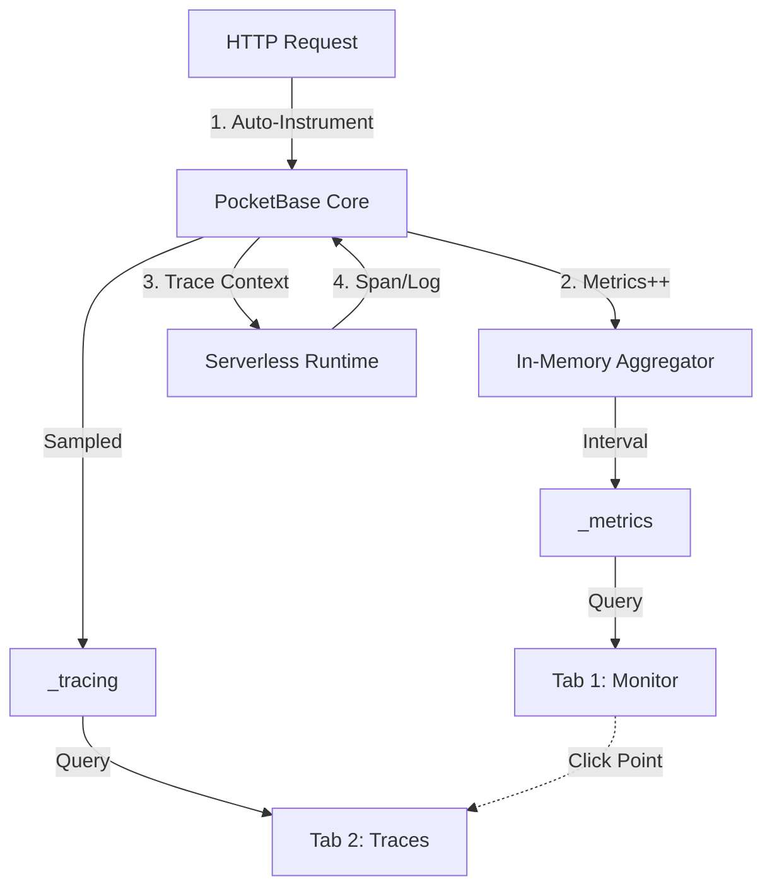

这是基于我们所有讨论（Postgres 架构、WASM Serverless、现有 UI 资产）整合而成的 **PocketBase Unified Observability** 最终版规格说明书。

它采纳了 **"Glass Box" (玻璃盒)** 的设计理念，将你现有的精美监控面板与新增的链路追踪无缝熔合。

---

# Spec: PocketBase Unified Observability

**Version**: 2.0.0 (Fusion)
**Type**: Core System Module
**Target**: `v2.0`
**Core Concept**: The "Three Pillars" (Metrics, Logs, Traces) under one roof.

## 1. Problem Essence (核心问题)

目前的系统存在观测孤岛：

1. **宏观孤岛**：图1 (Metrics) 能看到 "P95 延迟飙升"，但无法解释 "为什么"。
2. **微观孤岛**：图2 (Logs) 能看到 "500 Error"，但无法还原 "上下文"（是哪个 WASM 脚本调用的？是 DB 慢还是 OpenAI 慢？）。
3. **断裂**：从发现问题（Metrics）到定位问题（Logs）之间缺乏直接跳转路径，严重拖慢排查效率 (MTTR)。

## 2. Efficiency ROI (效能回报)

* **Drill-down Speed**: **10x**. 从 "CPU 尖峰" 点击直接跳转到 "导致尖峰的具体 Trace 列表"，秒级定位。
* **Visualized Debugging**: 通过瀑布图（Waterfall）直观展示 AI Agent 的异步调用链，无需猜测。
* **Asset Reuse**: **100%**. 完全保留并增强现有的 UI 代码（图1、图2），不进行破坏性重写，而是进行"超链接化"改造。

## 3. Architecture: The Fusion Model (融合模型)

### 3.1 Data Pipeline



### 3.2 Storage Strategy (Postgres Native)

为了保持单体架构的简洁性，我们不引入 Prometheus/Elasticsearch。

* **Metrics (`_metrics`)**:
* **Type**: `UNLOGGED TABLE` (High write speed).
* **Structure**: Time-series optimized (Hypertable-like schema).
* **Retention**: 自动 Cron 清理 7 天前数据。


* **Traces (`_tracing`)**:
* **Type**: `UNLOGGED TABLE`.
* **Structure**: 存储 Span 数据。
* **Sampling**: 默认开启 `Adaptive Sampling` (保留错单、慢单，丢弃部分正常单) 以节省空间。


## 4. UI Spec: The "Monitor" Center (UI 规范)

将左侧菜单的 "Logs" 升级为 **"Monitor"**，包含三个联动的 Tab。

### Tab 1: System (原图1 - 增强版)

**定位**: 宏观健康度概览。

* **保留**: CPU/Mem/Goroutines/P95 现有图表。
* **新增**:
* **WASM Stats**: 活跃实例数、平均执行耗时。
* **Job Queue**: 队列积压数 (Lag)、死信数。


* **交互增强 (The Linkage)**:
* **Action**: 点击折线图上的任意数据点（例如 14:05 的波峰）。
* **Effect**: 自动跳转到 Tab 2，并应用筛选条件 `start_time >= 14:04 AND start_time <= 14:06 AND duration >= 1000ms`。


### Tab 2: Traces (原图2 - 升级版)

**定位**: 事务级检索与排查。

* **改造**: 将原本的 "Request Log List" 升级为 "Trace List"。
* **Columns**:
* `Status` (200/500/Timeout)
* `Method` + `Path` (e.g. `POST /-/ai/analyze`)
* `Latency` (带颜色热力条)
* `Trace ID` (Copyable)


* **Filter Bar**: 支持按 `Duration > X`, `Status = 500`, `User ID` 筛选。

### Tab 3: Inspector (新增 - 瀑布图详情)

**定位**: 微观病因分析。

* **触发**: 点击 Tab 2 中的某一行。
* **展示**: 侧边抽屉 (Drawer) 弹出 **Waterfall Chart**。
* **Root**: `HTTP POST /api/chat` (Total: 800ms)
* **Child**: `[Go] Auth Middleware` (5ms)
* **Child**: `[WASM] agent.ts` (790ms)
* **GrandChild**: `[Fetch] api.openai.com` (700ms) -> *点击查看 Req/Res Body*
* **GrandChild**: `[DB] _jobs.enqueue` (10ms)


* **Logs**: 在时间轴下方穿插显示 WASM 的 `console.log` 内容。


## 5. Schema Definition (数据结构)

### 5.1 `_tracing` Collection

```sql
CREATE UNLOGGED TABLE _tracing (
    trace_id    TEXT NOT NULL,
    span_id     TEXT NOT NULL,
    parent_id   TEXT,
    name        TEXT NOT NULL, -- e.g. "db.query", "http.fetch"
    kind        TEXT,          -- "SERVER", "CLIENT", "INTERNAL"
    start_time  TIMESTAMP,     -- Microsecond precision
    end_time    TIMESTAMP,
    duration    INT,           -- Microseconds (Used for filtering)
    status      TEXT,          -- "OK", "ERROR"
    attributes  JSONB,         -- {"user_id": "...", "sql": "..."}
    events      JSONB          -- Array of logs [{"time":..., "msg":...}]
);
CREATE INDEX idx_tracing_time ON _tracing (start_time);
CREATE INDEX idx_tracing_dur ON _tracing (duration);

```

## 6. SDK & Host Functions (开发接入)

为了让图 2 的瀑布图能显示 WASM 内部细节，需要暴露 Host Functions。

### 6.1 WASM Host Functions

* `pb_trace_span_start(name, parent_ctx) -> span_id`
* `pb_trace_span_end(span_id)`
* `pb_trace_log(span_id, level, message)`: 将 `console.log` 劫持并挂载到当前 Span 下。

### 6.2 Auto-Instrumentation (零手动埋点)

* **PocketBase Gateway**: 自动为每个 HTTP 请求创建 Root Span。
* **DBX (Database)**: 自动拦截 SQL 执行，创建 DB Span。
* **Fetch**: 自动为外部请求创建 HTTP Span。

## 7. Boundaries & Anti-Stupidity (防愚蠢)

1. **Retention Policy (保留策略)**:
* Metrics 保留 30 天。
* Traces 保留 7 天 (或限制 1GB)。
* **实现**: 每天凌晨 Cron 任务执行 `DELETE FROM ...` (Unlogged 表删除极快)。


2. **Privacy (隐私)**:
* Trace 中的 `attributes` 自动脱敏。
* Header 过滤: `Authorization`, `Cookie`。
* Body 过滤: 若 Body > 4KB，截断存储；若包含 "password" 字段，掩码处理。


3. **Performance Protection**:
* **Async Write**: Trace 数据写入必须通过 Go Channel 异步批量入库，决不能阻塞主业务线程。
* **Circuit Breaker**: 如果 `_tracing` 表写入积压，直接丢弃 Trace 数据 (Drop Spans)，优先保业务。


## 8. Implementation Steps (实施步骤)

1. **Foundation**: 创建 `_tracing` 表，实现 `BatchWriter` (Go)。
2. **Instrumentation**:
* 改造 `logger.middleware` -> `tracing.middleware`。
* 改造 `dbx` 驱动，注入 Hook。
* 实现 WASM Host Functions。


3. **UI Integration**:
* 复用图1 组件构建 Tab 1。
* 复用图2 表格构建 Tab 2。
* **New**: 开发 Waterfall SVG 组件用于 Tab 3。
* **Wiring**: 实现图表点击跳转逻辑 (URL Query Params)。


---

**飞将军的总结**：
这个 Spec 并没有抛弃你现有的成果，而是为你已有的“仪表盘”和“日记本”之间接上了神经系统。现在，你的 PocketBase 不仅能告诉你 **"系统病了"** (Metrics)，还能精准地指给你看 **"病灶在哪里"** (Traces)。